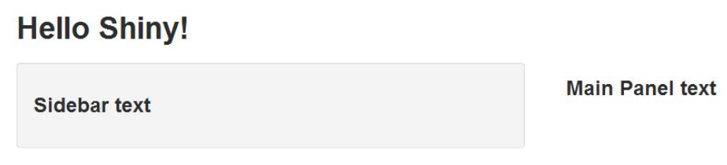
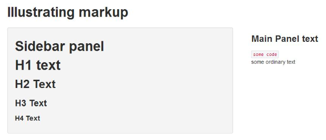

Here we go through using shiny to create web apps out of analysis pipelines you may have created using R. At the very least you need 2 files:

* One named `ui.R` to control interface and design
* One named `server.R` that controls what it actually does

Here are some very basic versions of these files. First **`ui.R`**:

```{r, eval=FALSE}
# ui.R
library(shiny) 
shinyUI(pageWithSidebar(
    headerPanel("Data science FTW!"), 
    sidebarPanel(h3('Sidebar text') ),
    mainPanel(h3('Main Panel text')) )
    )
```

Next **`server.R`**:

```{r, eval=FALSE}
# server.R
library(shiny)
shinyServer(
    function(input, output){
    }
) # basically does nothing
```

Then, navigate to the directory containing these files in `R` and type `runApp()`. It looks like this:



Basically you gotta add html codes to add style to your app, and these decorations are done in `ui.R`. For example, this code:

```{r, eval=FALSE}
shinyUI(pageWithSidebar(
    headerPanel("Illustrating markup"), 
    sidebarPanel(
        h1('Sidebar panel'), 
        h1('H1 text'), 
        h2('H2 Text'), 
        h3('H3 Text'), 
        h4('H4 Text')), 
    mainPanel(
        h3('Main Panel text'), 
        code('some code'), 
        p('some ordinary text')
    ) 
))
```

Would render this page:

