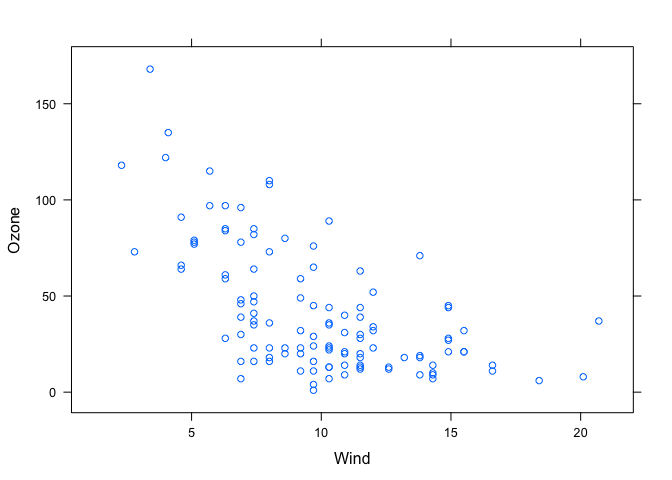
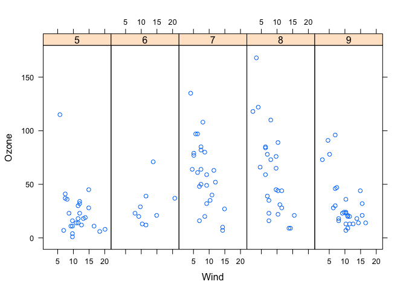
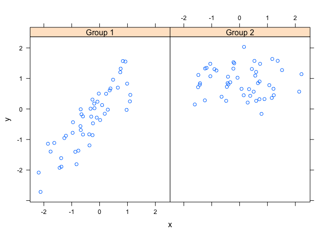
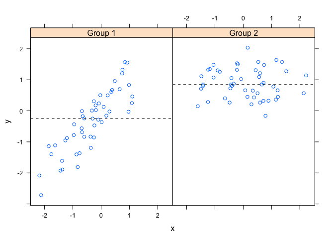
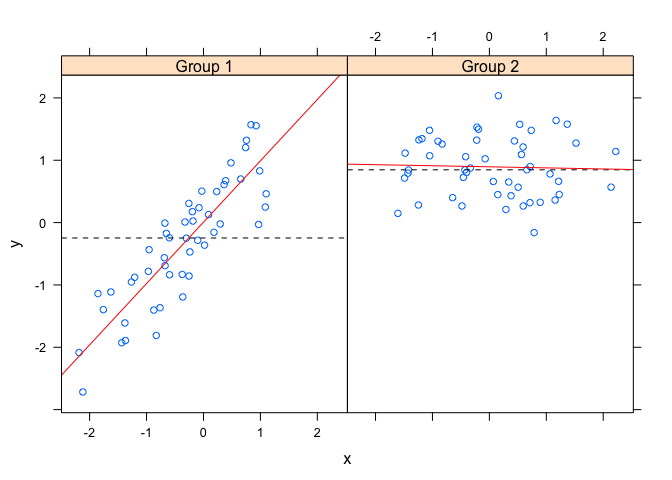
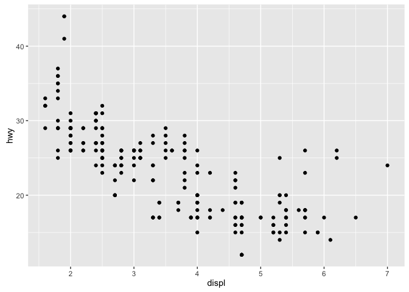
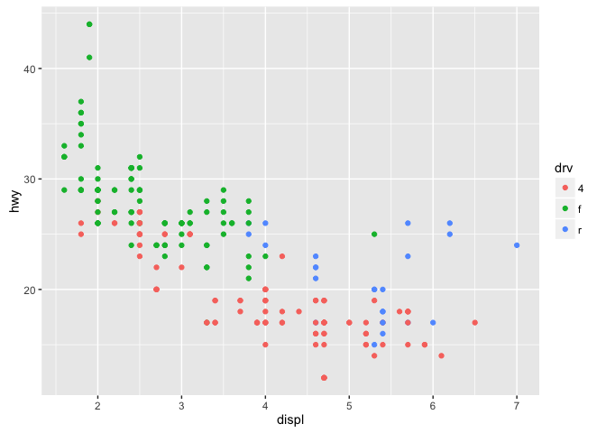
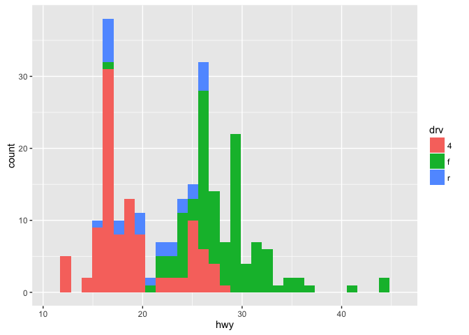
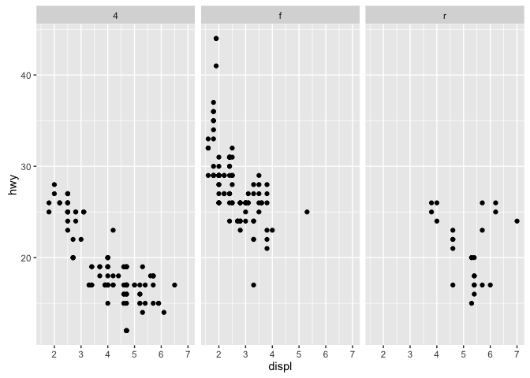
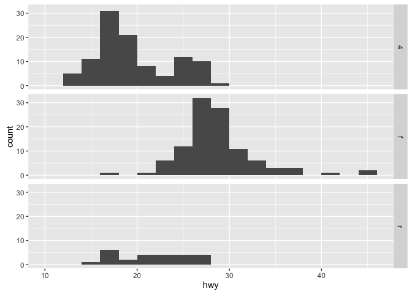

# Week 2 Notes

This week we explore the plotting systems lattice and ggplot in much detail. First we begin with lattice. 

# lattice

Lattice plots must be done in one command. The main functions in the lattice system are:

* `xyplot`: main function for creating scatter plots

* `bwplot`: box and whisker plot

* `histogram`: histograms

* `stripplot`: like a boxplot but with actual points

* `dotplot`: plot dots on "violin string"

* `splom`: matrix of scatter plots

* `levelplot`, `contourplot`: levels and contours of images

Lattice calls are usually of the form


```r
library(lattice)
xyplot(y ~ x | f * g, data)
```

`f` and `g` are conditioning variables and are optional, the `*` here represents interactions between variables. An example lattice plot:


```r
library(lattice)
library(datasets)
xyplot(Ozone ~ Wind, data = airquality)
```

\

And yet another one, slightly more complicated. Here we want to look at the distribution of `Wind` vs `Ozone` for each month


```r
airquality <- transform(airquality, Month = factor(Month))
xyplot(Ozone ~ Wind | Month, data = airquality, layout = c(5, 1))
```

\

We see the change in this relationship changes by month. Note we only have months 5 through 9 (May - June) in this dataset. Lattice objects need to be printed, so if you set the plot in a variable you need to explicitly `print()` it. 

Lattice have a panel function which controls what happens inside each panel of the plot. Each panel receives `x` and `y` coordinate of the data points in their panel. For each point in these variables, the panel will get the points of the variables.


```r
set.seed(10)
x <- rnorm(100)
f <- rep(0:1, each=50)
y <- x + f - x*f + rnorm(100, sd = 0.5)
f <- factor(f, labels = c("Group 1", "Group 2"))
xyplot(y ~ x | f, layout = c(2, 1)) # 2 panel plot
```

\

Let's explicitly call the panel functions using a tiny function to do the calls


```r
xyplot(y ~ x | f, panel = function(x, y, ...) {
                              panel.xyplot(x, y, ...) # panels them given x and y first
                              panel.abline(h = median(y), lty = 2) # horz line at median
                          }
)
```

\

The same example applying a simple linear regression line to each plot


```r
xyplot(y ~ x | f, panel = function(x, y, ...) {
                              panel.xyplot(x, y, ...) # panels them given x and y first
                              panel.abline(h = median(y), lty = 2) # horz line at median
                              panel.lmline(x, y, col = 2) # linear fit 
                          }
)
```

\


# ggplot

`ggplot` makes much prettier plots. Grammar of graphics based. Grammar of graphics represents and abstraction of graphics ideas/objects. In brief, the grammar tells us that a statistical graphic is a mapping from data to aesthetid attributes (colour, shape, size) or geometric objects (points, lines, bars). The plot may also contain statistical transformations of the data and is drawn on a specific coordinate system. Let's start with `qplot()`

One key difference is that you always have to tell the plot where the data comes from (usually a data frame). You also need to use factor variables, which will indicate the subsets of the data. 

We're going to use the mpg dataset. In particular we want the displacement variable (how large the engine is), the highway milage, and the `drv` (type of drive)

```r
library(ggplot2)
```

```
## Warning: package 'ggplot2' was built under R version 3.2.3
```

```r
str(mpg)
```

```
## Classes 'tbl_df', 'tbl' and 'data.frame':	234 obs. of  11 variables:
##  $ manufacturer: chr  "audi" "audi" "audi" "audi" ...
##  $ model       : chr  "a4" "a4" "a4" "a4" ...
##  $ displ       : num  1.8 1.8 2 2 2.8 2.8 3.1 1.8 1.8 2 ...
##  $ year        : int  1999 1999 2008 2008 1999 1999 2008 1999 1999 2008 ...
##  $ cyl         : int  4 4 4 4 6 6 6 4 4 4 ...
##  $ trans       : chr  "auto(l5)" "manual(m5)" "manual(m6)" "auto(av)" ...
##  $ drv         : chr  "f" "f" "f" "f" ...
##  $ cty         : int  18 21 20 21 16 18 18 18 16 20 ...
##  $ hwy         : int  29 29 31 30 26 26 27 26 25 28 ...
##  $ fl          : chr  "p" "p" "p" "p" ...
##  $ class       : chr  "compact" "compact" "compact" "compact" ...
```


```r
qplot(displ, hwy, data = mpg)
```

\

Let's modify the aesthetics to highlight the subgroups of the drive (4 wheel, front or rear drive)


```r
qplot(displ, hwy, data = mpg, color = drv)
```

\

** Adding a geom **
This is how you add a statistic, here is how you add a smoother with a 95% confidence interval


```r
qplot(displ, hwy, data = mpg, geom = c("point", "smooth"))
```

\

You can make a histogram with qplot by only specifying one variable. 


```r
qplot(hwy, data = mpg, fill = drv)
```

```
## `stat_bin()` using `bins = 30`. Pick better value with `binwidth`.
```

\

Another feature is called facets, which are like panels for lattice, the idea is you c an createa separate plot to create subsets of your data, and make a panel plots. 


```r
qplot(displ, hwy, data = mpg, facets = .~ drv)
```

\
If you make `facets = .~ variable`, it makes panels with column plots like above, and if you set `facets = variable .~` it makes a panel with row plots as seen below


```r
qplot(hwy, data = mpg, facets = drv ~., binwidth = 2)
```

\


