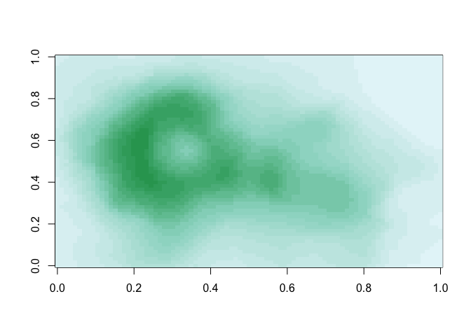
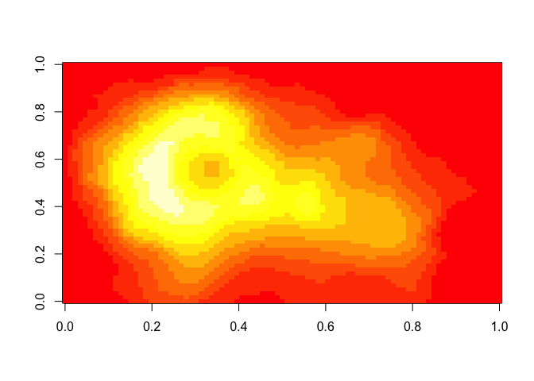
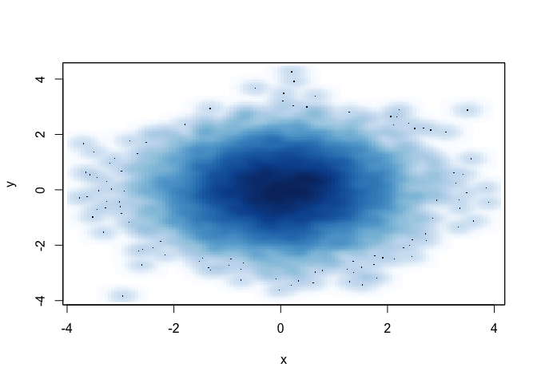
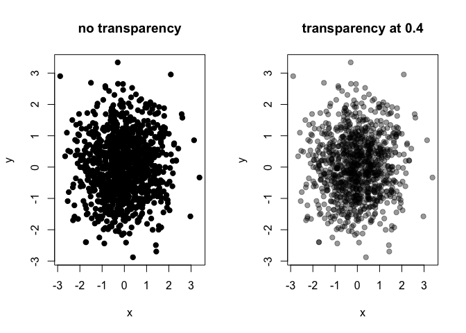

# Plotting and Color in R

This may seem like a basic thing to do, but color can add dimensions to your data plots so it's worth going through and seing what kinds of things you can do with it in different plotting systems. Judicious and appropriate use is very useful. 

The default color schemes for most plots in `R` are horrendous. Recent developments have made these pretty via packages. To see a full list of available colors in base `R`, type `colors()` in the console.

The `grDevices` package has two functions

1. `colorRamp()`: Takes a palette of colors and returns values between 0 and 1, that indicates the extremes of the color palette (see `gray()`)

2. `colorRampPalette()`: Takes a palette of colors and returns a function that takes an integer value to return a vector of colors interpolating the palette (like `heat.colors()`)

These functions tale palettes of colors and help interpolate between them. It's analogous to a painter mixing colors on a palette to create new colors. Here's an example:

 </img>

You see the different levels of red green and blue it takes to make each color. Kind of like a palette, and it numerically interpolates to create the new color value. Pretty cool. Here's an example of the `colorRampPalette`:


```r
pal <- colorRampPalette(c("red", "yellow"))
pal(2)
```

```
## [1] "#FF0000" "#FFFF00"
```

```r
pal(10) # interpolates 10 colors between red and yellow
```

```
##  [1] "#FF0000" "#FF1C00" "#FF3800" "#FF5500" "#FF7100" "#FF8D00" "#FFAA00"
##  [8] "#FFC600" "#FFE200" "#FFFF00"
```

Returns colors in hexadecimal values. Nice. 

Where do I come up with interesting palletes of color? You can use the `RColorBrewer` package. It creates a set of interesting palettes that you can use for different data. Create to make nice colors for maps. There are 3 types of palettes:

1. Sequential: Data that are ordered from low to high
2. Diverging: Data that diverge or deviate, e.g. deviations from the mean
3. Qualitative: Not ordered, factors or categorical data that have different values

You can pass the colors created to `colorRampPalette` and `colorRamp`. The function `brewer.pal()` is really the only useful function in the package.


```r
library(RColorBrewer)
cols <- brewer.pal(3, "BuGn")
cols
```

```
## [1] "#E5F5F9" "#99D8C9" "#2CA25F"
```

```r
pal <- colorRampPalette(cols)
image(volcano, col = pal(20))
```

\

Compare with the heatmap color


```r
image(volcano)
```

\

If you have to make a scatterplot of a LOT of different points (think your brain regions), then you may want to use the `smoothScatter` function, which comes with the graphics package.


```r
x <- rnorm(1e4)
y <- rnorm(1e4)
smoothScatter(x, y) # regular colors
```

\

# Some Final Color Notes

The `rgb()` function can be used to produce any color via red, green and blue proportions. You can also use it to specify transparency in your colors too! This is similar to setting an alpha value in matplotlib. Here's an example:


```r
x <- rnorm(1e3)
y <- rnorm(1e3)
par(mfrow = c(1, 2))
plot(x, y, pch = 19, main = "no transparency") 
plot(x, y, pch = 19, col = rgb(0, 0, 0, 0.4), main="transparency at 0.4")
```

\
