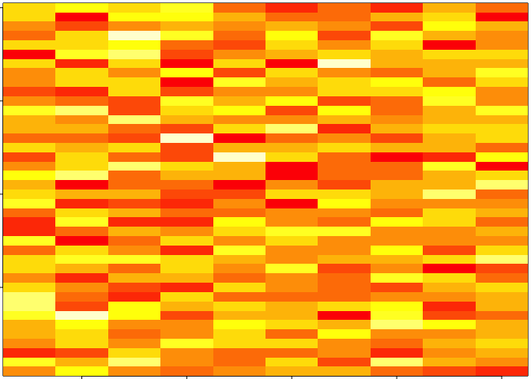
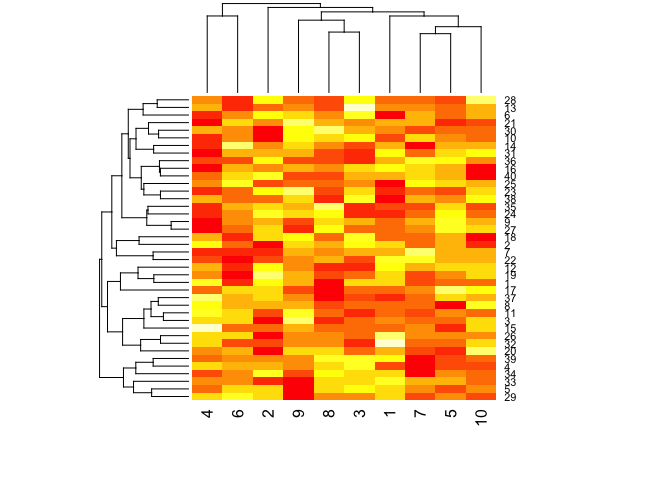
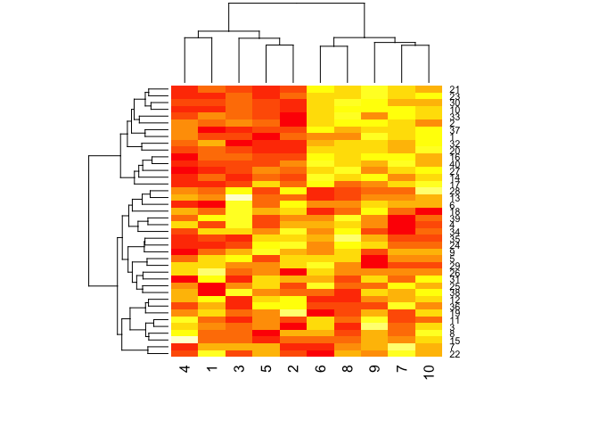
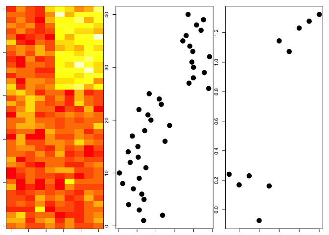
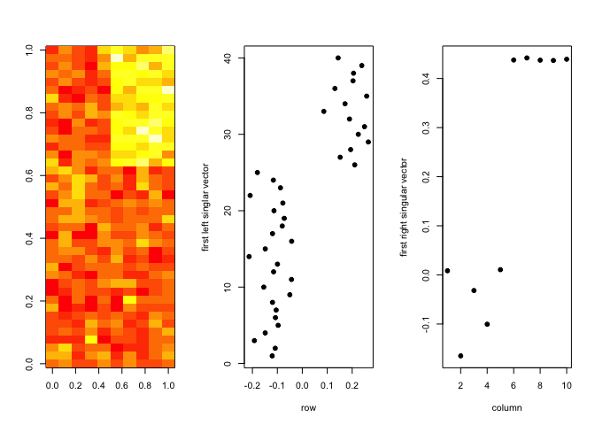
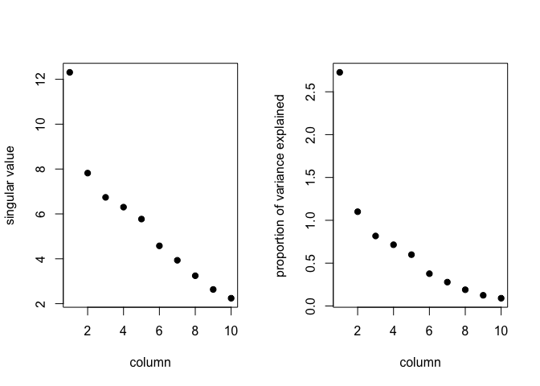
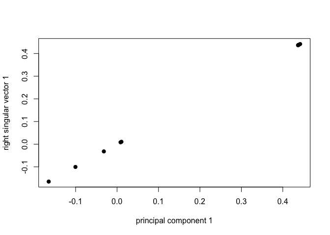
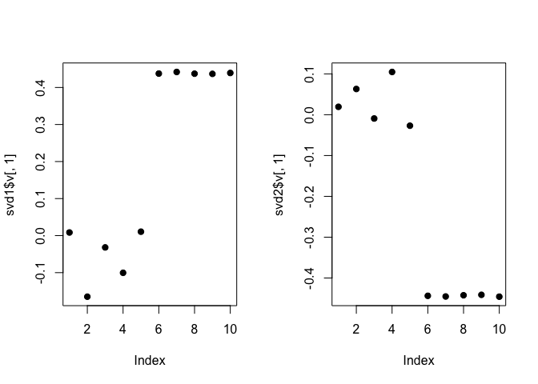
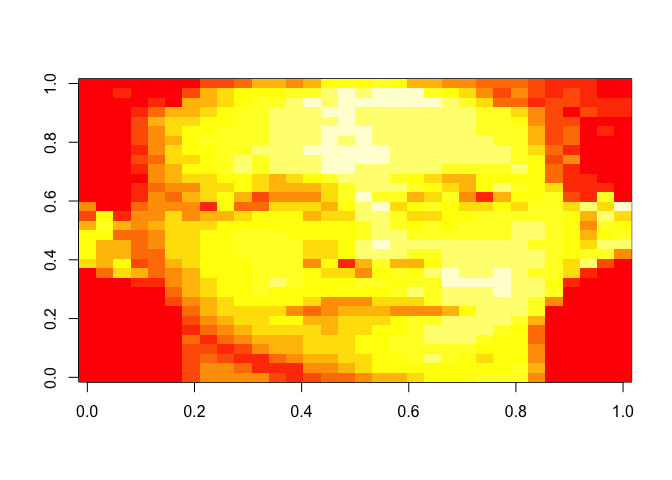
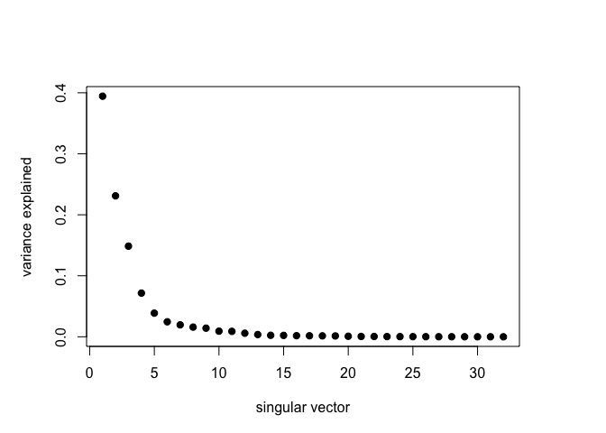

# Dimension Reduction

Suppose we had a matrix of values, as simulated below


```r
set.seed(12345)
par(mar = rep(0.2, 4))
dataMatrix <- matrix(rnorm(400), nrow = 40)
image(1:10, 1:40, t(dataMatrix)[, nrow(dataMatrix):1])
```

\


You see there's no real order or clustering groups in the data as you'd expect simulating normal random variables. You could just run a hierarchical clustering analysis on this data using the `heatmap()` function.


```r
par(mar = rep(0.2, 4))
heatmap(dataMatrix)
```

\

What if we add a pattern to the dataset


```r
set.seed(678345)
for (i in 1:40) {
    # flip a coin
    coinflip <- rbinom(1, size = 1, prob = 0.5)
    # if heads, add a common pattern to the row
    if (coinflip) {
        dataMatrix[i, ] <- dataMatrix[i, ] + rep(c(0, 3), each = 5) 
    }
}
# plot the result
heatmap(dataMatrix)
```

\

We can check out patterns in rows and columns. Run a hierarchical clustering on the resulting data matrix. We can plot the row vs row means and columns vs column means to extract patterns. There's a clear shift in the means as you go across the rows. Similarly there's a clear shift in each column. 


```r
hier_clust <- hclust(dist(dataMatrix))
dataMatrixOrdered <- dataMatrix[hier_clust$order, ]
par(mfrow = c(1, 3), mar = c(1, 1, 1, 1))
image(t(dataMatrixOrdered)[, nrow(dataMatrixOrdered):1])
plot(rowMeans(dataMatrixOrdered), 40:1, xlab = "Row Mean", ylab = "Row", pch = 19, cex = 2)
plot(colMeans(dataMatrixOrdered), xlab = "Column", ylab = "Column Mean", pch = 19, cex = 2)
```

\


# The Formal Reduction Problem

Here's the formal problem you want to answer using dimensionality reduction: 

Suppose you have multivariate variables $X_1, ..., X_n$ such that each $X_i = (X_{11}, ..., X_{1m}$. To reduce the dimensions we can think of the solution in two ways:

1. Find a new set of multivariate variables that are uncorrelated and explain as much variance as possible (**statistical**)

2. If you put the variables together in one matrix, find the best matrix created with fewer variables (lower rank) that explans the original data (**data compression**). 

The solution to both ways of thinking is *principal component analysis*, also called *SVD*. Simply put, solve the matrix X as $X = UDV^T$. Let's look at the $U$ and $V$ matrices with our example


```r
svd1 <- svd(scale(dataMatrixOrdered))
par(mfrow = c(1, 3))
image(t(dataMatrixOrdered)[, nrow(dataMatrixOrdered):1])
plot(svd1$u[, 1], 40:1, xlab = "row", ylab = "first left singlar vector", pch = 19)
plot(svd1$v[, 1], xlab = "column", ylab = "first right singular vector", pch = 19)
```

\

We see that the SVD algorithm picked up on the separation in the means unsupervised. The $D$ matrix can be plotted to represent to explainted variance. Remember these are the eigen values, which represent how much power is in each. The first plot below is just the raw eigen values, and the second is the power


```r
par(mfrow = c(1, 2))
plot(svd1$d, xlab = "column", ylab = "singular value", pch = 19)
plot(svd1$d^2/sum(svd1$d), xlab = "column", ylab = "proportion of variance explained", pch = 19)
```

\

The relaionship to principal components:


```r
pca1 <- prcomp(dataMatrixOrdered, scale = TRUE)
plot(pca1$rotation[, 1], svd1$v[, 1], pch = 19, xlab = "principal component 1", ylab = "right singular vector 1")
```

\

They are the exact same thing. 

# Dealing With Missing Values

One issue with svd is dealing with missing values, and real data typically has missing values.


```r
dataMatrix2 <- dataMatrixOrdered
# randomly insert NA's
dataMatrix2[sample(1:100, size = 40, replace = F)] <- NA
svd2 <- svd(scale(dataMatrix2)) 
```

```
## Error in svd(scale(dataMatrix2)): infinite or missing values in 'x'
```

You just can't run it on a dataset that has missing values. One possibility (out of many) is to use the `impute` library and impute the missing values. This will take the 5 rows closest to the data and impute the data based on those interpolated values.


```r
library(impute)
dataMatrix2 <- impute.knn(dataMatrix2)$data
svd2 <- svd(scale(dataMatrix2))
par(mfrow = c(1, 2))
plot(svd1$v[, 1], pch = 19)
plot(svd2$v[, 1], pch = 19)
```

\

Let's do an example on the face data found in base R. First let's view the face. It's a white boy's face. Downloaded from the course github page


```r
load("face.rda")
image(t(faceData)[, nrow(faceData):1])
```

\

Run the SVD and look at the variance explained


```r
par(mar = c(5, 5, 5, 5))
svdface <- svd(scale(faceData))
plot(svdface$d^2/sum(svdface$d^2), pch = 19, xlab = "singular vector", ylab = "variance explained")
```

\

We see that 40% of the variance is explained by the first component, about 25% by the second, and so on. We see the first 5 to 10 singular vectors campture most of the variation in the data. You can threshold the data in this fashion, keeping only the first $n$ principal components. In image processing this is done all the time. 

# Important notes

Keep in mind the scale matters. PC's may mix real patterns. This can be computationally intensive. Some alternatives include factor analysis, ICA, and latent semantic analysis.
