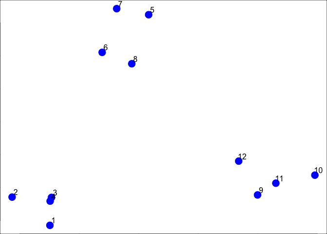
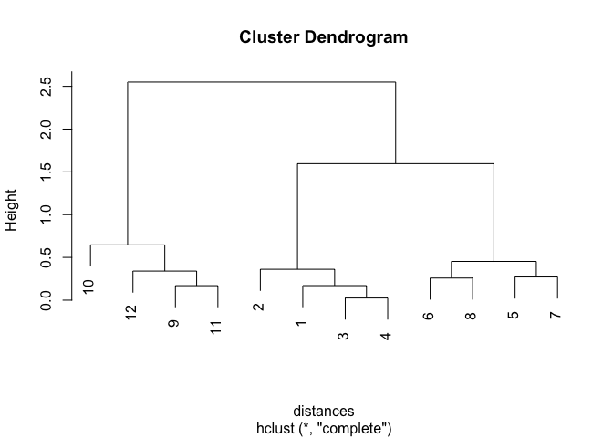
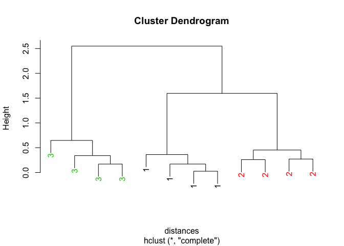
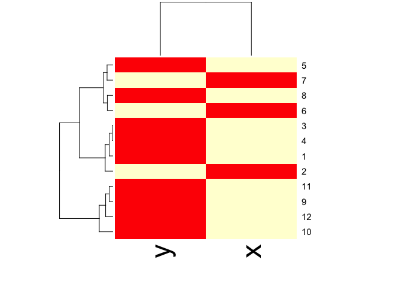

# Hierarchical Clustering

This is kind of a bread and butter technique to visual high dimensional data. It organizes things into "close groups". What determines what is close or not though? How do we visualize the grouping? How do we interpret it? 

Hierarchical clustering is an agglomerative approach, i.e. you find the two closest things, put them together and find the next closest. It requires a defined distance and a merging approach. It produces a tree showing how close things are to each other. How do we define close? Pick a similarity/distance that makes sense for your problem. Some examples include the euclidean distance (continuous), correlation similarity (continuous), manhattan distance (binary). Let's do a clustering example.


```r
set.seed(0)
par(mar = c(0, 0, 0, 0))
x <- rnorm(12, mean = rep(1:3, each = 4), sd = 0.2)
y <- rnorm(12, mean = rep(c(1, 2, 1), each = 4), sd = 0.2)
plot(x, y, col = "blue", pch = 19, cex = 2)
text(x + 0.03, y + 0.03, labels = as.character(1:12))
```

\

Clearly these cluster into 3 distinct visibly different groups. First thing you need to do is to calculate the pairwise distances between the points. It's easiest to  do this with data frames. This will create a "matrix" of distance values with indices (i,j) corresponding to the distance between point i and point j.


```r
df <- data.frame(x, y)
distances <- dist(df) # other distance metrics available as options
```

So we're going to take the points closest together, and merge them into a single cluster. Then replace the 2 points with the merged point. Then continue in that fashion. Pretty simple. R has a clustering function for distances built in, and you can plot the resulting dendogram.


```r
hClustering <- hclust(distances)
plot(hClustering)
```

\

This doesn't actually tell you how many clusters there are though. You have to cut this tree at a certain point to determine how many there are. We can use a function on the course website called `myplclust` (download it from there) to make prettier clusters that are labelled with different colors corresponding to the different clusters:


```r
myplclust(hClustering, lab = rep(1:3, each = 4), lab.col = rep(1:3, each = 4))
```

\

Keep in mind that in order to do this you have to know how many clusters there are in your data. One useful function to keep in mind is the `heatmap()` function. This takes the rows an columns of your data frame or matrix and runs a cluster analysis on them. Here's an example with our data.


```r
df_matrix <- as.matrix(df)
heatmap(df_matrix)
```

\

So what it does is it creates an image plot, and it reorders the columns and rows according to the hierarchical clustering algorithm. This is really useful for quickly visualizing higher dimensional data. 

You need to define distance and you need a merging strategy. Remember this should be primarily used for exploration. For more resources on this, watch [this video](https://www.youtube.com/watch?v=wQhVWUcXM0A)
