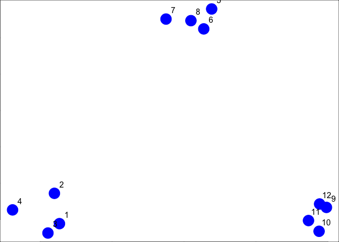
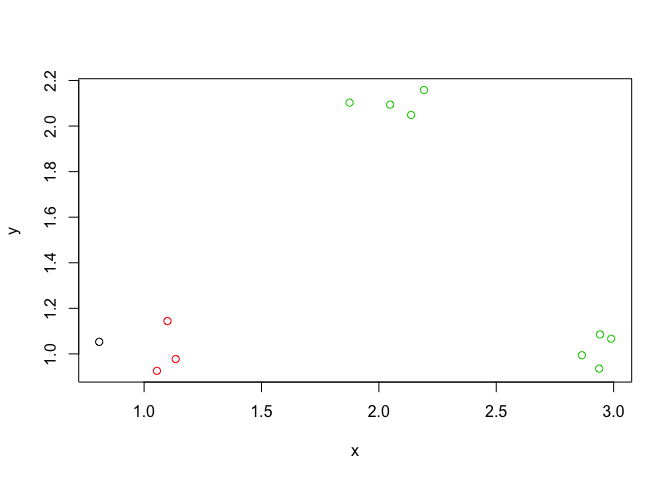
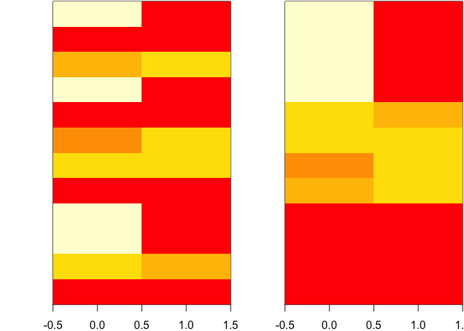

# K-Means Clustering

Similarly to hierarchical clustering, we need a distance metric. This method fixes a number of clusters, get the centroids for each cluster, and assign things to closest centroids. It formally requires:

1. A defined distance metric

2. A number of clusters

3. An initial guess as to cluster centroids

Here's an example, generated with random data, on how to use the k-means clustering algorithm. First build the data


```r
set.seed(1234567890)
par(mar = c(0, 0 , 0, 0))
x <- rnorm(12, mean = rep(1:3, each = 4), sd = 0.1)
y <- rnorm(12, mean = rep(c(1, 2, 1), each = 4), sd = 0.1)
plot(x, y, col = "blue", pch = 19, cex = 3)
text(x+0.05, y+0.05, labels = as.character(1:12))
```

\

As before we see 3 distinct clusters. Basically you choose 3 cluster points, it finds the closest points to each centroid, and updates itself by the mean each step until convergence. We can use the `kmeans()` function in `R`.


```r
df <- data.frame(x, y)
kmeansobj <- kmeans(df, centers = 3)
names(kmeansobj)
```

```
## [1] "cluster"      "centers"      "totss"        "withinss"    
## [5] "tot.withinss" "betweenss"    "size"         "iter"        
## [9] "ifault"
```

```r
kmeansobj$cluster
```

```
##  [1] 2 2 2 1 3 3 3 3 3 3 3 3
```

If you wana plot the kmeans result, plot the color as the kmeans cluster


```r
plot(x, y, col = kmeansobj$cluster)
```

\

You can also make use of the heatmap function 


```r
dm <- as.matrix(df)[sample(1:12), ]
kmeansobj2 <- kmeans(dm, centers = 3)
par(mfrow = c(1, 2), mar = c(2, 4, 0.1, 0.1))
image(t(dm)[, nrow(dm):1], yaxt = "n")
image(t(dm)[, order(kmeansobj2$cluster)], yaxt = "n") # order clusters together
```

\

In this way you can reorganize the rows or columns based on rows that are close together. 
