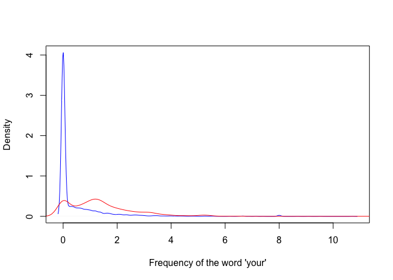

# Notes

Jeff says that sampling and probability to split test and training sets is often overlooked. This is true in the U of W specialization, as we just rely on some random sampling based on some algorithm I'm not sure about. Here's a classification example question: Can I accurately classify emails as SPAM or HAM based on some characteristics of the emails? There is a dataset found in base R called `spam`, this contains a collection of the frequencies of a certain set of words in a collection of emails.


```r
library(kernlab)
data(spam)
str(spam)
```

```
## 'data.frame':	4601 obs. of  58 variables:
##  $ make             : num  0 0.21 0.06 0 0 0 0 0 0.15 0.06 ...
##  $ address          : num  0.64 0.28 0 0 0 0 0 0 0 0.12 ...
##  $ all              : num  0.64 0.5 0.71 0 0 0 0 0 0.46 0.77 ...
##  $ num3d            : num  0 0 0 0 0 0 0 0 0 0 ...
##  $ our              : num  0.32 0.14 1.23 0.63 0.63 1.85 1.92 1.88 0.61 0.19 ...
##  $ over             : num  0 0.28 0.19 0 0 0 0 0 0 0.32 ...
##  $ remove           : num  0 0.21 0.19 0.31 0.31 0 0 0 0.3 0.38 ...
##  $ internet         : num  0 0.07 0.12 0.63 0.63 1.85 0 1.88 0 0 ...
##  $ order            : num  0 0 0.64 0.31 0.31 0 0 0 0.92 0.06 ...
##  $ mail             : num  0 0.94 0.25 0.63 0.63 0 0.64 0 0.76 0 ...
##  $ receive          : num  0 0.21 0.38 0.31 0.31 0 0.96 0 0.76 0 ...
##  $ will             : num  0.64 0.79 0.45 0.31 0.31 0 1.28 0 0.92 0.64 ...
##  $ people           : num  0 0.65 0.12 0.31 0.31 0 0 0 0 0.25 ...
##  $ report           : num  0 0.21 0 0 0 0 0 0 0 0 ...
##  $ addresses        : num  0 0.14 1.75 0 0 0 0 0 0 0.12 ...
##  $ free             : num  0.32 0.14 0.06 0.31 0.31 0 0.96 0 0 0 ...
##  $ business         : num  0 0.07 0.06 0 0 0 0 0 0 0 ...
##  $ email            : num  1.29 0.28 1.03 0 0 0 0.32 0 0.15 0.12 ...
##  $ you              : num  1.93 3.47 1.36 3.18 3.18 0 3.85 0 1.23 1.67 ...
##  $ credit           : num  0 0 0.32 0 0 0 0 0 3.53 0.06 ...
##  $ your             : num  0.96 1.59 0.51 0.31 0.31 0 0.64 0 2 0.71 ...
##  $ font             : num  0 0 0 0 0 0 0 0 0 0 ...
##  $ num000           : num  0 0.43 1.16 0 0 0 0 0 0 0.19 ...
##  $ money            : num  0 0.43 0.06 0 0 0 0 0 0.15 0 ...
##  $ hp               : num  0 0 0 0 0 0 0 0 0 0 ...
##  $ hpl              : num  0 0 0 0 0 0 0 0 0 0 ...
##  $ george           : num  0 0 0 0 0 0 0 0 0 0 ...
##  $ num650           : num  0 0 0 0 0 0 0 0 0 0 ...
##  $ lab              : num  0 0 0 0 0 0 0 0 0 0 ...
##  $ labs             : num  0 0 0 0 0 0 0 0 0 0 ...
##  $ telnet           : num  0 0 0 0 0 0 0 0 0 0 ...
##  $ num857           : num  0 0 0 0 0 0 0 0 0 0 ...
##  $ data             : num  0 0 0 0 0 0 0 0 0.15 0 ...
##  $ num415           : num  0 0 0 0 0 0 0 0 0 0 ...
##  $ num85            : num  0 0 0 0 0 0 0 0 0 0 ...
##  $ technology       : num  0 0 0 0 0 0 0 0 0 0 ...
##  $ num1999          : num  0 0.07 0 0 0 0 0 0 0 0 ...
##  $ parts            : num  0 0 0 0 0 0 0 0 0 0 ...
##  $ pm               : num  0 0 0 0 0 0 0 0 0 0 ...
##  $ direct           : num  0 0 0.06 0 0 0 0 0 0 0 ...
##  $ cs               : num  0 0 0 0 0 0 0 0 0 0 ...
##  $ meeting          : num  0 0 0 0 0 0 0 0 0 0 ...
##  $ original         : num  0 0 0.12 0 0 0 0 0 0.3 0 ...
##  $ project          : num  0 0 0 0 0 0 0 0 0 0.06 ...
##  $ re               : num  0 0 0.06 0 0 0 0 0 0 0 ...
##  $ edu              : num  0 0 0.06 0 0 0 0 0 0 0 ...
##  $ table            : num  0 0 0 0 0 0 0 0 0 0 ...
##  $ conference       : num  0 0 0 0 0 0 0 0 0 0 ...
##  $ charSemicolon    : num  0 0 0.01 0 0 0 0 0 0 0.04 ...
##  $ charRoundbracket : num  0 0.132 0.143 0.137 0.135 0.223 0.054 0.206 0.271 0.03 ...
##  $ charSquarebracket: num  0 0 0 0 0 0 0 0 0 0 ...
##  $ charExclamation  : num  0.778 0.372 0.276 0.137 0.135 0 0.164 0 0.181 0.244 ...
##  $ charDollar       : num  0 0.18 0.184 0 0 0 0.054 0 0.203 0.081 ...
##  $ charHash         : num  0 0.048 0.01 0 0 0 0 0 0.022 0 ...
##  $ capitalAve       : num  3.76 5.11 9.82 3.54 3.54 ...
##  $ capitalLong      : num  61 101 485 40 40 15 4 11 445 43 ...
##  $ capitalTotal     : num  278 1028 2259 191 191 ...
##  $ type             : Factor w/ 2 levels "nonspam","spam": 2 2 2 2 2 2 2 2 2 2 ...
```

```r
# plot the density of spam vs non spam emails that contain the word your
plot(density(spam$your[spam$type=="nonspam"]),
     col = "blue",
     main = "", 
     xlab = "Frequency of the word 'your'")
lines(density(spam$your[spam$type=="spam"]),
      col = "red")
```

\

Emails that are spam have more "your" than non-spam emails. Build a predictor based on a cutoff after the large blue spike. This is pretty naive, but let's go ahead and do that


```r
prediction <- ifelse(spam$your>0.5, "spam", "nonspam")
table(prediction, spam$type)/length(spam$type)
```

```
##           
## prediction   nonspam      spam
##    nonspam 0.4590306 0.1017170
##    spam    0.1469246 0.2923278
```

We see the accuracy is 45% + 29% = 74%. 

#### The question you are asking is the most important part of a machine learning sequence

You need to have a good concrete question in order to obtain a reasonable answer. The second most important thing is the quality of data. In general, garbage in = garbage out. The data you have is very very important. The "best" machine learning method will be interpretable, simple, accurate, fast and scalable if you want it to be useful in the real world. 

## In sample error vs out of sample error

In sample error is the error rate you get on the same data set you used to build your predictor error. This is also called resubstitution error. 

Out of sample error is the error rate you get on your new dataset. This is also called ** generalization error **. Generally speaking, in sample error rate is smaller than your generalization error, due to overfitting (this depends on model complexity too). 

## Types of errors

When you're trying to predict in terms of a binary variable (two classes), the types of errors are

1. True positive; correctly identified
2. False positive; incorrectly identified
3. True negative; correctly rejected
3. False negative; incorectly rejected

## ROC curves

Stands for receiver operating characteristic. This is a plot of 1 - specificity, which is a measure of the false positives, and the sensitivity on the y axis, which is a measure of true positives. This curve tells you about the tradeoffs of both. You usually plot this and calculate the area under the curve (AUC). AUC = 0.5 is equivalent to random guessing. AUC above 0.8 is generally considered good.

## Cross validation

In k-fold cross validation, larger k -> less bias, more variance. Smaller k -> more bias, less variance.

## Choosing data

Like predicts like. Pick data as closely related to the data as possible. Unrelated data is the most common mistake, so make sure you know **where the data comes from and what it's describing (what the features are)***
