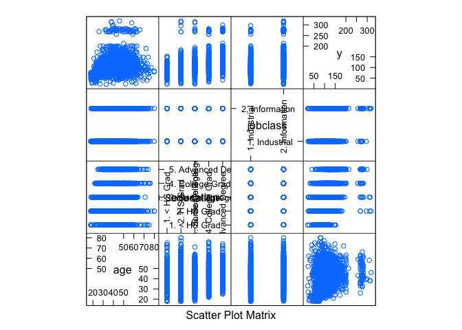
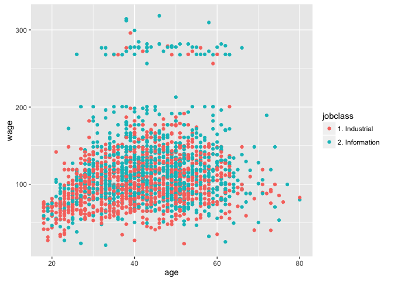
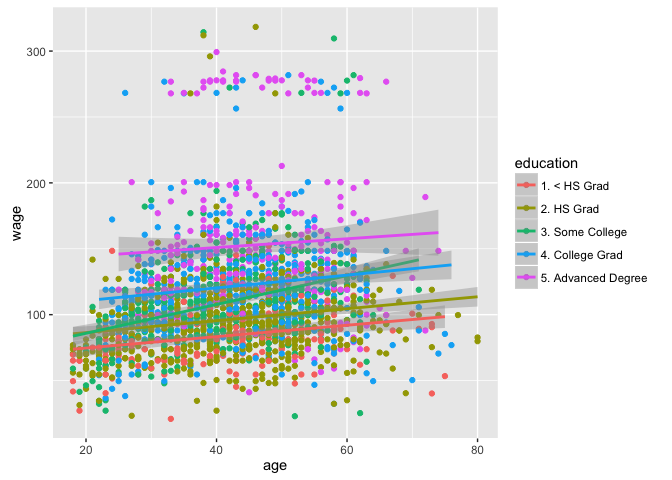
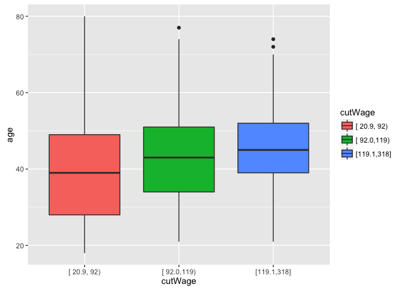
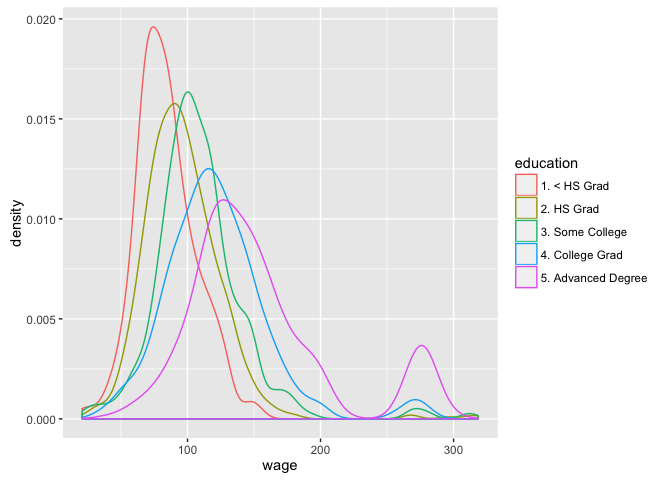

# Plotting Predictors

# Example with wages data


```r
library(ISLR); library(ggplot2); library(caret)
data(Wage)
summary(Wage)
```

```
##       year           age               sex                    maritl    
##  Min.   :2003   Min.   :18.00   1. Male  :3000   1. Never Married: 648  
##  1st Qu.:2004   1st Qu.:33.75   2. Female:   0   2. Married      :2074  
##  Median :2006   Median :42.00                    3. Widowed      :  19  
##  Mean   :2006   Mean   :42.41                    4. Divorced     : 204  
##  3rd Qu.:2008   3rd Qu.:51.00                    5. Separated    :  55  
##  Max.   :2009   Max.   :80.00                                           
##                                                                         
##        race                   education                     region    
##  1. White:2480   1. < HS Grad      :268   2. Middle Atlantic   :3000  
##  2. Black: 293   2. HS Grad        :971   1. New England       :   0  
##  3. Asian: 190   3. Some College   :650   3. East North Central:   0  
##  4. Other:  37   4. College Grad   :685   4. West North Central:   0  
##                  5. Advanced Degree:426   5. South Atlantic    :   0  
##                                           6. East South Central:   0  
##                                           (Other)              :   0  
##            jobclass               health      health_ins      logwage     
##  1. Industrial :1544   1. <=Good     : 858   1. Yes:2083   Min.   :3.000  
##  2. Information:1456   2. >=Very Good:2142   2. No : 917   1st Qu.:4.447  
##                                                            Median :4.653  
##                                                            Mean   :4.654  
##                                                            3rd Qu.:4.857  
##                                                            Max.   :5.763  
##                                                                           
##       wage       
##  Min.   : 20.09  
##  1st Qu.: 85.38  
##  Median :104.92  
##  Mean   :111.70  
##  3rd Qu.:128.68  
##  Max.   :318.34  
## 
```

Now let's train and test the data. 


```r
inTrain <- createDataPartition(y=Wage$wage, p=0.7, list = FALSE)
training <- Wage[inTrain, ]
testing <- Wage[-inTrain, ]

# feature plot
featurePlot(x = training[, c("age", "education", "jobclass")],
            y = training$wage,
            plot = "pairs")
```

\

```r
# simple ggplot plot of age vs wage, coloring the job class (info vs industrial)
qplot(age, wage, colour = jobclass, data = training) 
```

\

```r
# add regression smoothers, this time using as color the education group
qplot(age, wage, colour = education, data = training) +
    geom_smooth(method = "lm")
```

\

You can also make different factors based on quantiles of a continuous variable. Suppose you wanted to examine certain groups of wages. You can use the `cut2` function to do so:


```r
library(Hmisc)
```

```
## Loading required package: survival
```

```
## 
## Attaching package: 'survival'
```

```
## The following object is masked from 'package:caret':
## 
##     cluster
```

```
## Loading required package: Formula
```

```
## 
## Attaching package: 'Hmisc'
```

```
## The following objects are masked from 'package:base':
## 
##     format.pval, round.POSIXt, trunc.POSIXt, units
```

```r
cutWage <- cut2(training$wage, g=3)
table(cutWage)
```

```
## cutWage
## [ 20.9, 92) [ 92.0,119) [119.1,318] 
##         701         725         676
```

```r
# plot different wage groups
qplot(cutWage, age, data = training, fill = cutWage, geom="boxplot")
```

\

Density plots are also very useful, here we examine the density of wages as education levels change


```r
qplot(wage, colour = education, data = training, geom = "density")
```

\
