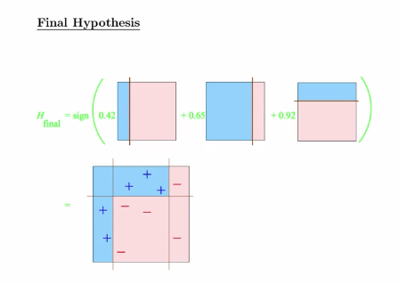

The idea is to take a lot of possibly weak predictors, weight and add them up, and get a stronger predictor. 



Here's an example using the wage data

```{r, cache = T, message=F}
library(ISLR)
data(Wage)
library(ggplot2)
library(caret)

Wage <- subset(Wage, select = -c(logwage))

inTrain <- createDataPartition(y = Wage$wage, 
                               p = .7,
                               list = F)
training <- Wage[inTrain, ]
testing <- Wage[-inTrain, ]

# the model
modfit <- train(wage ~ ., method = "gbm", data = training, verbose = F)

# plot the result
qplot(predict(modfit, testing), wage, data = testing)
```