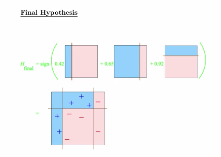

# Boosting

The idea is to take a lot of possibly weak predictors, weight and add them up, and get a stronger predictor. 



Here's an example using the wage data


```r
library(ISLR)
data(Wage)
library(ggplot2)
library(caret)

Wage <- subset(Wage, select = -c(logwage))

inTrain <- createDataPartition(y = Wage$wage, 
                               p = .7,
                               list = F)
training <- Wage[inTrain, ]
testing <- Wage[-inTrain, ]

# the model
modfit <- train(wage ~ ., method = "gbm", data = training, verbose = F)
```

```
## Warning in gbm.fit(x = structure(c(2006, 2004, 2007, 2007, 2009, 2009,
## 2003, : variable 3: sex2. Female has no variation.
```

```
## Warning in gbm.fit(x = structure(c(2006, 2004, 2007, 2007, 2009, 2009,
## 2003, : variable 15: region2. Middle Atlantic has no variation.
```

```
## Warning in gbm.fit(x = structure(c(2006, 2004, 2007, 2007, 2009, 2009,
## 2003, : variable 16: region3. East North Central has no variation.
```

```
## Warning in gbm.fit(x = structure(c(2006, 2004, 2007, 2007, 2009, 2009,
## 2003, : variable 17: region4. West North Central has no variation.
```

```
## Warning in gbm.fit(x = structure(c(2006, 2004, 2007, 2007, 2009, 2009,
## 2003, : variable 18: region5. South Atlantic has no variation.
```

```
## Warning in gbm.fit(x = structure(c(2006, 2004, 2007, 2007, 2009, 2009,
## 2003, : variable 19: region6. East South Central has no variation.
```

```
## Warning in gbm.fit(x = structure(c(2006, 2004, 2007, 2007, 2009, 2009,
## 2003, : variable 20: region7. West South Central has no variation.
```

```
## Warning in gbm.fit(x = structure(c(2006, 2004, 2007, 2007, 2009, 2009,
## 2003, : variable 21: region8. Mountain has no variation.
```

```
## Warning in gbm.fit(x = structure(c(2006, 2004, 2007, 2007, 2009, 2009,
## 2003, : variable 22: region9. Pacific has no variation.
```

```
## Warning in gbm.fit(x = structure(c(2006, 2004, 2007, 2007, 2009, 2009,
## 2003, : variable 3: sex2. Female has no variation.
```

```
## Warning in gbm.fit(x = structure(c(2006, 2004, 2007, 2007, 2009, 2009,
## 2003, : variable 15: region2. Middle Atlantic has no variation.
```

```
## Warning in gbm.fit(x = structure(c(2006, 2004, 2007, 2007, 2009, 2009,
## 2003, : variable 16: region3. East North Central has no variation.
```

```
## Warning in gbm.fit(x = structure(c(2006, 2004, 2007, 2007, 2009, 2009,
## 2003, : variable 17: region4. West North Central has no variation.
```

```
## Warning in gbm.fit(x = structure(c(2006, 2004, 2007, 2007, 2009, 2009,
## 2003, : variable 18: region5. South Atlantic has no variation.
```

```
## Warning in gbm.fit(x = structure(c(2006, 2004, 2007, 2007, 2009, 2009,
## 2003, : variable 19: region6. East South Central has no variation.
```

```
## Warning in gbm.fit(x = structure(c(2006, 2004, 2007, 2007, 2009, 2009,
## 2003, : variable 20: region7. West South Central has no variation.
```

```
## Warning in gbm.fit(x = structure(c(2006, 2004, 2007, 2007, 2009, 2009,
## 2003, : variable 21: region8. Mountain has no variation.
```

```
## Warning in gbm.fit(x = structure(c(2006, 2004, 2007, 2007, 2009, 2009,
## 2003, : variable 22: region9. Pacific has no variation.
```

```
## Warning in gbm.fit(x = structure(c(2006, 2004, 2007, 2007, 2009, 2009,
## 2003, : variable 3: sex2. Female has no variation.
```

```
## Warning in gbm.fit(x = structure(c(2006, 2004, 2007, 2007, 2009, 2009,
## 2003, : variable 15: region2. Middle Atlantic has no variation.
```

```
## Warning in gbm.fit(x = structure(c(2006, 2004, 2007, 2007, 2009, 2009,
## 2003, : variable 16: region3. East North Central has no variation.
```

```
## Warning in gbm.fit(x = structure(c(2006, 2004, 2007, 2007, 2009, 2009,
## 2003, : variable 17: region4. West North Central has no variation.
```

```
## Warning in gbm.fit(x = structure(c(2006, 2004, 2007, 2007, 2009, 2009,
## 2003, : variable 18: region5. South Atlantic has no variation.
```

```
## Warning in gbm.fit(x = structure(c(2006, 2004, 2007, 2007, 2009, 2009,
## 2003, : variable 19: region6. East South Central has no variation.
```

```
## Warning in gbm.fit(x = structure(c(2006, 2004, 2007, 2007, 2009, 2009,
## 2003, : variable 20: region7. West South Central has no variation.
```

```
## Warning in gbm.fit(x = structure(c(2006, 2004, 2007, 2007, 2009, 2009,
## 2003, : variable 21: region8. Mountain has no variation.
```

```
## Warning in gbm.fit(x = structure(c(2006, 2004, 2007, 2007, 2009, 2009,
## 2003, : variable 22: region9. Pacific has no variation.
```

```
## Warning in gbm.fit(x = structure(c(2006, 2006, 2004, 2003, 2003, 2009,
## 2009, : variable 3: sex2. Female has no variation.
```

```
## Warning in gbm.fit(x = structure(c(2006, 2006, 2004, 2003, 2003, 2009,
## 2009, : variable 15: region2. Middle Atlantic has no variation.
```

```
## Warning in gbm.fit(x = structure(c(2006, 2006, 2004, 2003, 2003, 2009,
## 2009, : variable 16: region3. East North Central has no variation.
```

```
## Warning in gbm.fit(x = structure(c(2006, 2006, 2004, 2003, 2003, 2009,
## 2009, : variable 17: region4. West North Central has no variation.
```

```
## Warning in gbm.fit(x = structure(c(2006, 2006, 2004, 2003, 2003, 2009,
## 2009, : variable 18: region5. South Atlantic has no variation.
```

```
## Warning in gbm.fit(x = structure(c(2006, 2006, 2004, 2003, 2003, 2009,
## 2009, : variable 19: region6. East South Central has no variation.
```

```
## Warning in gbm.fit(x = structure(c(2006, 2006, 2004, 2003, 2003, 2009,
## 2009, : variable 20: region7. West South Central has no variation.
```

```
## Warning in gbm.fit(x = structure(c(2006, 2006, 2004, 2003, 2003, 2009,
## 2009, : variable 21: region8. Mountain has no variation.
```

```
## Warning in gbm.fit(x = structure(c(2006, 2006, 2004, 2003, 2003, 2009,
## 2009, : variable 22: region9. Pacific has no variation.
```

```
## Warning in gbm.fit(x = structure(c(2006, 2006, 2004, 2003, 2003, 2009,
## 2009, : variable 3: sex2. Female has no variation.
```

```
## Warning in gbm.fit(x = structure(c(2006, 2006, 2004, 2003, 2003, 2009,
## 2009, : variable 15: region2. Middle Atlantic has no variation.
```

```
## Warning in gbm.fit(x = structure(c(2006, 2006, 2004, 2003, 2003, 2009,
## 2009, : variable 16: region3. East North Central has no variation.
```

```
## Warning in gbm.fit(x = structure(c(2006, 2006, 2004, 2003, 2003, 2009,
## 2009, : variable 17: region4. West North Central has no variation.
```

```
## Warning in gbm.fit(x = structure(c(2006, 2006, 2004, 2003, 2003, 2009,
## 2009, : variable 18: region5. South Atlantic has no variation.
```

```
## Warning in gbm.fit(x = structure(c(2006, 2006, 2004, 2003, 2003, 2009,
## 2009, : variable 19: region6. East South Central has no variation.
```

```
## Warning in gbm.fit(x = structure(c(2006, 2006, 2004, 2003, 2003, 2009,
## 2009, : variable 20: region7. West South Central has no variation.
```

```
## Warning in gbm.fit(x = structure(c(2006, 2006, 2004, 2003, 2003, 2009,
## 2009, : variable 21: region8. Mountain has no variation.
```

```
## Warning in gbm.fit(x = structure(c(2006, 2006, 2004, 2003, 2003, 2009,
## 2009, : variable 22: region9. Pacific has no variation.
```

```
## Warning in gbm.fit(x = structure(c(2006, 2006, 2004, 2003, 2003, 2009,
## 2009, : variable 3: sex2. Female has no variation.
```

```
## Warning in gbm.fit(x = structure(c(2006, 2006, 2004, 2003, 2003, 2009,
## 2009, : variable 15: region2. Middle Atlantic has no variation.
```

```
## Warning in gbm.fit(x = structure(c(2006, 2006, 2004, 2003, 2003, 2009,
## 2009, : variable 16: region3. East North Central has no variation.
```

```
## Warning in gbm.fit(x = structure(c(2006, 2006, 2004, 2003, 2003, 2009,
## 2009, : variable 17: region4. West North Central has no variation.
```

```
## Warning in gbm.fit(x = structure(c(2006, 2006, 2004, 2003, 2003, 2009,
## 2009, : variable 18: region5. South Atlantic has no variation.
```

```
## Warning in gbm.fit(x = structure(c(2006, 2006, 2004, 2003, 2003, 2009,
## 2009, : variable 19: region6. East South Central has no variation.
```

```
## Warning in gbm.fit(x = structure(c(2006, 2006, 2004, 2003, 2003, 2009,
## 2009, : variable 20: region7. West South Central has no variation.
```

```
## Warning in gbm.fit(x = structure(c(2006, 2006, 2004, 2003, 2003, 2009,
## 2009, : variable 21: region8. Mountain has no variation.
```

```
## Warning in gbm.fit(x = structure(c(2006, 2006, 2004, 2003, 2003, 2009,
## 2009, : variable 22: region9. Pacific has no variation.
```

```
## Warning in gbm.fit(x = structure(c(2006, 2006, 2006, 2004, 2008, 2008,
## 2009, : variable 3: sex2. Female has no variation.
```

```
## Warning in gbm.fit(x = structure(c(2006, 2006, 2006, 2004, 2008, 2008,
## 2009, : variable 15: region2. Middle Atlantic has no variation.
```

```
## Warning in gbm.fit(x = structure(c(2006, 2006, 2006, 2004, 2008, 2008,
## 2009, : variable 16: region3. East North Central has no variation.
```

```
## Warning in gbm.fit(x = structure(c(2006, 2006, 2006, 2004, 2008, 2008,
## 2009, : variable 17: region4. West North Central has no variation.
```

```
## Warning in gbm.fit(x = structure(c(2006, 2006, 2006, 2004, 2008, 2008,
## 2009, : variable 18: region5. South Atlantic has no variation.
```

```
## Warning in gbm.fit(x = structure(c(2006, 2006, 2006, 2004, 2008, 2008,
## 2009, : variable 19: region6. East South Central has no variation.
```

```
## Warning in gbm.fit(x = structure(c(2006, 2006, 2006, 2004, 2008, 2008,
## 2009, : variable 20: region7. West South Central has no variation.
```

```
## Warning in gbm.fit(x = structure(c(2006, 2006, 2006, 2004, 2008, 2008,
## 2009, : variable 21: region8. Mountain has no variation.
```

```
## Warning in gbm.fit(x = structure(c(2006, 2006, 2006, 2004, 2008, 2008,
## 2009, : variable 22: region9. Pacific has no variation.
```

```
## Warning in gbm.fit(x = structure(c(2006, 2006, 2006, 2004, 2008, 2008,
## 2009, : variable 3: sex2. Female has no variation.
```

```
## Warning in gbm.fit(x = structure(c(2006, 2006, 2006, 2004, 2008, 2008,
## 2009, : variable 15: region2. Middle Atlantic has no variation.
```

```
## Warning in gbm.fit(x = structure(c(2006, 2006, 2006, 2004, 2008, 2008,
## 2009, : variable 16: region3. East North Central has no variation.
```

```
## Warning in gbm.fit(x = structure(c(2006, 2006, 2006, 2004, 2008, 2008,
## 2009, : variable 17: region4. West North Central has no variation.
```

```
## Warning in gbm.fit(x = structure(c(2006, 2006, 2006, 2004, 2008, 2008,
## 2009, : variable 18: region5. South Atlantic has no variation.
```

```
## Warning in gbm.fit(x = structure(c(2006, 2006, 2006, 2004, 2008, 2008,
## 2009, : variable 19: region6. East South Central has no variation.
```

```
## Warning in gbm.fit(x = structure(c(2006, 2006, 2006, 2004, 2008, 2008,
## 2009, : variable 20: region7. West South Central has no variation.
```

```
## Warning in gbm.fit(x = structure(c(2006, 2006, 2006, 2004, 2008, 2008,
## 2009, : variable 21: region8. Mountain has no variation.
```

```
## Warning in gbm.fit(x = structure(c(2006, 2006, 2006, 2004, 2008, 2008,
## 2009, : variable 22: region9. Pacific has no variation.
```

```
## Warning in gbm.fit(x = structure(c(2006, 2006, 2006, 2004, 2008, 2008,
## 2009, : variable 3: sex2. Female has no variation.
```

```
## Warning in gbm.fit(x = structure(c(2006, 2006, 2006, 2004, 2008, 2008,
## 2009, : variable 15: region2. Middle Atlantic has no variation.
```

```
## Warning in gbm.fit(x = structure(c(2006, 2006, 2006, 2004, 2008, 2008,
## 2009, : variable 16: region3. East North Central has no variation.
```

```
## Warning in gbm.fit(x = structure(c(2006, 2006, 2006, 2004, 2008, 2008,
## 2009, : variable 17: region4. West North Central has no variation.
```

```
## Warning in gbm.fit(x = structure(c(2006, 2006, 2006, 2004, 2008, 2008,
## 2009, : variable 18: region5. South Atlantic has no variation.
```

```
## Warning in gbm.fit(x = structure(c(2006, 2006, 2006, 2004, 2008, 2008,
## 2009, : variable 19: region6. East South Central has no variation.
```

```
## Warning in gbm.fit(x = structure(c(2006, 2006, 2006, 2004, 2008, 2008,
## 2009, : variable 20: region7. West South Central has no variation.
```

```
## Warning in gbm.fit(x = structure(c(2006, 2006, 2006, 2004, 2008, 2008,
## 2009, : variable 21: region8. Mountain has no variation.
```

```
## Warning in gbm.fit(x = structure(c(2006, 2006, 2006, 2004, 2008, 2008,
## 2009, : variable 22: region9. Pacific has no variation.
```

```
## Warning in gbm.fit(x = structure(c(2006, 2004, 2004, 2003, 2008, 2008,
## 2008, : variable 3: sex2. Female has no variation.
```

```
## Warning in gbm.fit(x = structure(c(2006, 2004, 2004, 2003, 2008, 2008,
## 2008, : variable 15: region2. Middle Atlantic has no variation.
```

```
## Warning in gbm.fit(x = structure(c(2006, 2004, 2004, 2003, 2008, 2008,
## 2008, : variable 16: region3. East North Central has no variation.
```

```
## Warning in gbm.fit(x = structure(c(2006, 2004, 2004, 2003, 2008, 2008,
## 2008, : variable 17: region4. West North Central has no variation.
```

```
## Warning in gbm.fit(x = structure(c(2006, 2004, 2004, 2003, 2008, 2008,
## 2008, : variable 18: region5. South Atlantic has no variation.
```

```
## Warning in gbm.fit(x = structure(c(2006, 2004, 2004, 2003, 2008, 2008,
## 2008, : variable 19: region6. East South Central has no variation.
```

```
## Warning in gbm.fit(x = structure(c(2006, 2004, 2004, 2003, 2008, 2008,
## 2008, : variable 20: region7. West South Central has no variation.
```

```
## Warning in gbm.fit(x = structure(c(2006, 2004, 2004, 2003, 2008, 2008,
## 2008, : variable 21: region8. Mountain has no variation.
```

```
## Warning in gbm.fit(x = structure(c(2006, 2004, 2004, 2003, 2008, 2008,
## 2008, : variable 22: region9. Pacific has no variation.
```

```
## Warning in gbm.fit(x = structure(c(2006, 2004, 2004, 2003, 2008, 2008,
## 2008, : variable 3: sex2. Female has no variation.
```

```
## Warning in gbm.fit(x = structure(c(2006, 2004, 2004, 2003, 2008, 2008,
## 2008, : variable 15: region2. Middle Atlantic has no variation.
```

```
## Warning in gbm.fit(x = structure(c(2006, 2004, 2004, 2003, 2008, 2008,
## 2008, : variable 16: region3. East North Central has no variation.
```

```
## Warning in gbm.fit(x = structure(c(2006, 2004, 2004, 2003, 2008, 2008,
## 2008, : variable 17: region4. West North Central has no variation.
```

```
## Warning in gbm.fit(x = structure(c(2006, 2004, 2004, 2003, 2008, 2008,
## 2008, : variable 18: region5. South Atlantic has no variation.
```

```
## Warning in gbm.fit(x = structure(c(2006, 2004, 2004, 2003, 2008, 2008,
## 2008, : variable 19: region6. East South Central has no variation.
```

```
## Warning in gbm.fit(x = structure(c(2006, 2004, 2004, 2003, 2008, 2008,
## 2008, : variable 20: region7. West South Central has no variation.
```

```
## Warning in gbm.fit(x = structure(c(2006, 2004, 2004, 2003, 2008, 2008,
## 2008, : variable 21: region8. Mountain has no variation.
```

```
## Warning in gbm.fit(x = structure(c(2006, 2004, 2004, 2003, 2008, 2008,
## 2008, : variable 22: region9. Pacific has no variation.
```

```
## Warning in gbm.fit(x = structure(c(2006, 2004, 2004, 2003, 2008, 2008,
## 2008, : variable 3: sex2. Female has no variation.
```

```
## Warning in gbm.fit(x = structure(c(2006, 2004, 2004, 2003, 2008, 2008,
## 2008, : variable 15: region2. Middle Atlantic has no variation.
```

```
## Warning in gbm.fit(x = structure(c(2006, 2004, 2004, 2003, 2008, 2008,
## 2008, : variable 16: region3. East North Central has no variation.
```

```
## Warning in gbm.fit(x = structure(c(2006, 2004, 2004, 2003, 2008, 2008,
## 2008, : variable 17: region4. West North Central has no variation.
```

```
## Warning in gbm.fit(x = structure(c(2006, 2004, 2004, 2003, 2008, 2008,
## 2008, : variable 18: region5. South Atlantic has no variation.
```

```
## Warning in gbm.fit(x = structure(c(2006, 2004, 2004, 2003, 2008, 2008,
## 2008, : variable 19: region6. East South Central has no variation.
```

```
## Warning in gbm.fit(x = structure(c(2006, 2004, 2004, 2003, 2008, 2008,
## 2008, : variable 20: region7. West South Central has no variation.
```

```
## Warning in gbm.fit(x = structure(c(2006, 2004, 2004, 2003, 2008, 2008,
## 2008, : variable 21: region8. Mountain has no variation.
```

```
## Warning in gbm.fit(x = structure(c(2006, 2004, 2004, 2003, 2008, 2008,
## 2008, : variable 22: region9. Pacific has no variation.
```

```
## Warning in gbm.fit(x = structure(c(2004, 2004, 2003, 2003, 2003, 2009,
## 2007, : variable 3: sex2. Female has no variation.
```

```
## Warning in gbm.fit(x = structure(c(2004, 2004, 2003, 2003, 2003, 2009,
## 2007, : variable 15: region2. Middle Atlantic has no variation.
```

```
## Warning in gbm.fit(x = structure(c(2004, 2004, 2003, 2003, 2003, 2009,
## 2007, : variable 16: region3. East North Central has no variation.
```

```
## Warning in gbm.fit(x = structure(c(2004, 2004, 2003, 2003, 2003, 2009,
## 2007, : variable 17: region4. West North Central has no variation.
```

```
## Warning in gbm.fit(x = structure(c(2004, 2004, 2003, 2003, 2003, 2009,
## 2007, : variable 18: region5. South Atlantic has no variation.
```

```
## Warning in gbm.fit(x = structure(c(2004, 2004, 2003, 2003, 2003, 2009,
## 2007, : variable 19: region6. East South Central has no variation.
```

```
## Warning in gbm.fit(x = structure(c(2004, 2004, 2003, 2003, 2003, 2009,
## 2007, : variable 20: region7. West South Central has no variation.
```

```
## Warning in gbm.fit(x = structure(c(2004, 2004, 2003, 2003, 2003, 2009,
## 2007, : variable 21: region8. Mountain has no variation.
```

```
## Warning in gbm.fit(x = structure(c(2004, 2004, 2003, 2003, 2003, 2009,
## 2007, : variable 22: region9. Pacific has no variation.
```

```
## Warning in gbm.fit(x = structure(c(2004, 2004, 2003, 2003, 2003, 2009,
## 2007, : variable 3: sex2. Female has no variation.
```

```
## Warning in gbm.fit(x = structure(c(2004, 2004, 2003, 2003, 2003, 2009,
## 2007, : variable 15: region2. Middle Atlantic has no variation.
```

```
## Warning in gbm.fit(x = structure(c(2004, 2004, 2003, 2003, 2003, 2009,
## 2007, : variable 16: region3. East North Central has no variation.
```

```
## Warning in gbm.fit(x = structure(c(2004, 2004, 2003, 2003, 2003, 2009,
## 2007, : variable 17: region4. West North Central has no variation.
```

```
## Warning in gbm.fit(x = structure(c(2004, 2004, 2003, 2003, 2003, 2009,
## 2007, : variable 18: region5. South Atlantic has no variation.
```

```
## Warning in gbm.fit(x = structure(c(2004, 2004, 2003, 2003, 2003, 2009,
## 2007, : variable 19: region6. East South Central has no variation.
```

```
## Warning in gbm.fit(x = structure(c(2004, 2004, 2003, 2003, 2003, 2009,
## 2007, : variable 20: region7. West South Central has no variation.
```

```
## Warning in gbm.fit(x = structure(c(2004, 2004, 2003, 2003, 2003, 2009,
## 2007, : variable 21: region8. Mountain has no variation.
```

```
## Warning in gbm.fit(x = structure(c(2004, 2004, 2003, 2003, 2003, 2009,
## 2007, : variable 22: region9. Pacific has no variation.
```

```
## Warning in gbm.fit(x = structure(c(2004, 2004, 2003, 2003, 2003, 2009,
## 2007, : variable 3: sex2. Female has no variation.
```

```
## Warning in gbm.fit(x = structure(c(2004, 2004, 2003, 2003, 2003, 2009,
## 2007, : variable 15: region2. Middle Atlantic has no variation.
```

```
## Warning in gbm.fit(x = structure(c(2004, 2004, 2003, 2003, 2003, 2009,
## 2007, : variable 16: region3. East North Central has no variation.
```

```
## Warning in gbm.fit(x = structure(c(2004, 2004, 2003, 2003, 2003, 2009,
## 2007, : variable 17: region4. West North Central has no variation.
```

```
## Warning in gbm.fit(x = structure(c(2004, 2004, 2003, 2003, 2003, 2009,
## 2007, : variable 18: region5. South Atlantic has no variation.
```

```
## Warning in gbm.fit(x = structure(c(2004, 2004, 2003, 2003, 2003, 2009,
## 2007, : variable 19: region6. East South Central has no variation.
```

```
## Warning in gbm.fit(x = structure(c(2004, 2004, 2003, 2003, 2003, 2009,
## 2007, : variable 20: region7. West South Central has no variation.
```

```
## Warning in gbm.fit(x = structure(c(2004, 2004, 2003, 2003, 2003, 2009,
## 2007, : variable 21: region8. Mountain has no variation.
```

```
## Warning in gbm.fit(x = structure(c(2004, 2004, 2003, 2003, 2003, 2009,
## 2007, : variable 22: region9. Pacific has no variation.
```

```
## Warning in gbm.fit(x = structure(c(2004, 2008, 2009, 2009, 2008, 2007,
## 2003, : variable 3: sex2. Female has no variation.
```

```
## Warning in gbm.fit(x = structure(c(2004, 2008, 2009, 2009, 2008, 2007,
## 2003, : variable 15: region2. Middle Atlantic has no variation.
```

```
## Warning in gbm.fit(x = structure(c(2004, 2008, 2009, 2009, 2008, 2007,
## 2003, : variable 16: region3. East North Central has no variation.
```

```
## Warning in gbm.fit(x = structure(c(2004, 2008, 2009, 2009, 2008, 2007,
## 2003, : variable 17: region4. West North Central has no variation.
```

```
## Warning in gbm.fit(x = structure(c(2004, 2008, 2009, 2009, 2008, 2007,
## 2003, : variable 18: region5. South Atlantic has no variation.
```

```
## Warning in gbm.fit(x = structure(c(2004, 2008, 2009, 2009, 2008, 2007,
## 2003, : variable 19: region6. East South Central has no variation.
```

```
## Warning in gbm.fit(x = structure(c(2004, 2008, 2009, 2009, 2008, 2007,
## 2003, : variable 20: region7. West South Central has no variation.
```

```
## Warning in gbm.fit(x = structure(c(2004, 2008, 2009, 2009, 2008, 2007,
## 2003, : variable 21: region8. Mountain has no variation.
```

```
## Warning in gbm.fit(x = structure(c(2004, 2008, 2009, 2009, 2008, 2007,
## 2003, : variable 22: region9. Pacific has no variation.
```

```
## Warning in gbm.fit(x = structure(c(2004, 2008, 2009, 2009, 2008, 2007,
## 2003, : variable 3: sex2. Female has no variation.
```

```
## Warning in gbm.fit(x = structure(c(2004, 2008, 2009, 2009, 2008, 2007,
## 2003, : variable 15: region2. Middle Atlantic has no variation.
```

```
## Warning in gbm.fit(x = structure(c(2004, 2008, 2009, 2009, 2008, 2007,
## 2003, : variable 16: region3. East North Central has no variation.
```

```
## Warning in gbm.fit(x = structure(c(2004, 2008, 2009, 2009, 2008, 2007,
## 2003, : variable 17: region4. West North Central has no variation.
```

```
## Warning in gbm.fit(x = structure(c(2004, 2008, 2009, 2009, 2008, 2007,
## 2003, : variable 18: region5. South Atlantic has no variation.
```

```
## Warning in gbm.fit(x = structure(c(2004, 2008, 2009, 2009, 2008, 2007,
## 2003, : variable 19: region6. East South Central has no variation.
```

```
## Warning in gbm.fit(x = structure(c(2004, 2008, 2009, 2009, 2008, 2007,
## 2003, : variable 20: region7. West South Central has no variation.
```

```
## Warning in gbm.fit(x = structure(c(2004, 2008, 2009, 2009, 2008, 2007,
## 2003, : variable 21: region8. Mountain has no variation.
```

```
## Warning in gbm.fit(x = structure(c(2004, 2008, 2009, 2009, 2008, 2007,
## 2003, : variable 22: region9. Pacific has no variation.
```

```
## Warning in gbm.fit(x = structure(c(2004, 2008, 2009, 2009, 2008, 2007,
## 2003, : variable 3: sex2. Female has no variation.
```

```
## Warning in gbm.fit(x = structure(c(2004, 2008, 2009, 2009, 2008, 2007,
## 2003, : variable 15: region2. Middle Atlantic has no variation.
```

```
## Warning in gbm.fit(x = structure(c(2004, 2008, 2009, 2009, 2008, 2007,
## 2003, : variable 16: region3. East North Central has no variation.
```

```
## Warning in gbm.fit(x = structure(c(2004, 2008, 2009, 2009, 2008, 2007,
## 2003, : variable 17: region4. West North Central has no variation.
```

```
## Warning in gbm.fit(x = structure(c(2004, 2008, 2009, 2009, 2008, 2007,
## 2003, : variable 18: region5. South Atlantic has no variation.
```

```
## Warning in gbm.fit(x = structure(c(2004, 2008, 2009, 2009, 2008, 2007,
## 2003, : variable 19: region6. East South Central has no variation.
```

```
## Warning in gbm.fit(x = structure(c(2004, 2008, 2009, 2009, 2008, 2007,
## 2003, : variable 20: region7. West South Central has no variation.
```

```
## Warning in gbm.fit(x = structure(c(2004, 2008, 2009, 2009, 2008, 2007,
## 2003, : variable 21: region8. Mountain has no variation.
```

```
## Warning in gbm.fit(x = structure(c(2004, 2008, 2009, 2009, 2008, 2007,
## 2003, : variable 22: region9. Pacific has no variation.
```

```
## Warning in gbm.fit(x = structure(c(2004, 2003, 2008, 2008, 2009, 2009,
## 2009, : variable 3: sex2. Female has no variation.
```

```
## Warning in gbm.fit(x = structure(c(2004, 2003, 2008, 2008, 2009, 2009,
## 2009, : variable 15: region2. Middle Atlantic has no variation.
```

```
## Warning in gbm.fit(x = structure(c(2004, 2003, 2008, 2008, 2009, 2009,
## 2009, : variable 16: region3. East North Central has no variation.
```

```
## Warning in gbm.fit(x = structure(c(2004, 2003, 2008, 2008, 2009, 2009,
## 2009, : variable 17: region4. West North Central has no variation.
```

```
## Warning in gbm.fit(x = structure(c(2004, 2003, 2008, 2008, 2009, 2009,
## 2009, : variable 18: region5. South Atlantic has no variation.
```

```
## Warning in gbm.fit(x = structure(c(2004, 2003, 2008, 2008, 2009, 2009,
## 2009, : variable 19: region6. East South Central has no variation.
```

```
## Warning in gbm.fit(x = structure(c(2004, 2003, 2008, 2008, 2009, 2009,
## 2009, : variable 20: region7. West South Central has no variation.
```

```
## Warning in gbm.fit(x = structure(c(2004, 2003, 2008, 2008, 2009, 2009,
## 2009, : variable 21: region8. Mountain has no variation.
```

```
## Warning in gbm.fit(x = structure(c(2004, 2003, 2008, 2008, 2009, 2009,
## 2009, : variable 22: region9. Pacific has no variation.
```

```
## Warning in gbm.fit(x = structure(c(2004, 2003, 2008, 2008, 2009, 2009,
## 2009, : variable 3: sex2. Female has no variation.
```

```
## Warning in gbm.fit(x = structure(c(2004, 2003, 2008, 2008, 2009, 2009,
## 2009, : variable 15: region2. Middle Atlantic has no variation.
```

```
## Warning in gbm.fit(x = structure(c(2004, 2003, 2008, 2008, 2009, 2009,
## 2009, : variable 16: region3. East North Central has no variation.
```

```
## Warning in gbm.fit(x = structure(c(2004, 2003, 2008, 2008, 2009, 2009,
## 2009, : variable 17: region4. West North Central has no variation.
```

```
## Warning in gbm.fit(x = structure(c(2004, 2003, 2008, 2008, 2009, 2009,
## 2009, : variable 18: region5. South Atlantic has no variation.
```

```
## Warning in gbm.fit(x = structure(c(2004, 2003, 2008, 2008, 2009, 2009,
## 2009, : variable 19: region6. East South Central has no variation.
```

```
## Warning in gbm.fit(x = structure(c(2004, 2003, 2008, 2008, 2009, 2009,
## 2009, : variable 20: region7. West South Central has no variation.
```

```
## Warning in gbm.fit(x = structure(c(2004, 2003, 2008, 2008, 2009, 2009,
## 2009, : variable 21: region8. Mountain has no variation.
```

```
## Warning in gbm.fit(x = structure(c(2004, 2003, 2008, 2008, 2009, 2009,
## 2009, : variable 22: region9. Pacific has no variation.
```

```
## Warning in gbm.fit(x = structure(c(2004, 2003, 2008, 2008, 2009, 2009,
## 2009, : variable 3: sex2. Female has no variation.
```

```
## Warning in gbm.fit(x = structure(c(2004, 2003, 2008, 2008, 2009, 2009,
## 2009, : variable 15: region2. Middle Atlantic has no variation.
```

```
## Warning in gbm.fit(x = structure(c(2004, 2003, 2008, 2008, 2009, 2009,
## 2009, : variable 16: region3. East North Central has no variation.
```

```
## Warning in gbm.fit(x = structure(c(2004, 2003, 2008, 2008, 2009, 2009,
## 2009, : variable 17: region4. West North Central has no variation.
```

```
## Warning in gbm.fit(x = structure(c(2004, 2003, 2008, 2008, 2009, 2009,
## 2009, : variable 18: region5. South Atlantic has no variation.
```

```
## Warning in gbm.fit(x = structure(c(2004, 2003, 2008, 2008, 2009, 2009,
## 2009, : variable 19: region6. East South Central has no variation.
```

```
## Warning in gbm.fit(x = structure(c(2004, 2003, 2008, 2008, 2009, 2009,
## 2009, : variable 20: region7. West South Central has no variation.
```

```
## Warning in gbm.fit(x = structure(c(2004, 2003, 2008, 2008, 2009, 2009,
## 2009, : variable 21: region8. Mountain has no variation.
```

```
## Warning in gbm.fit(x = structure(c(2004, 2003, 2008, 2008, 2009, 2009,
## 2009, : variable 22: region9. Pacific has no variation.
```

```
## Warning in gbm.fit(x = structure(c(2006, 2004, 2004, 2004, 2008, 2007,
## 2007, : variable 3: sex2. Female has no variation.
```

```
## Warning in gbm.fit(x = structure(c(2006, 2004, 2004, 2004, 2008, 2007,
## 2007, : variable 15: region2. Middle Atlantic has no variation.
```

```
## Warning in gbm.fit(x = structure(c(2006, 2004, 2004, 2004, 2008, 2007,
## 2007, : variable 16: region3. East North Central has no variation.
```

```
## Warning in gbm.fit(x = structure(c(2006, 2004, 2004, 2004, 2008, 2007,
## 2007, : variable 17: region4. West North Central has no variation.
```

```
## Warning in gbm.fit(x = structure(c(2006, 2004, 2004, 2004, 2008, 2007,
## 2007, : variable 18: region5. South Atlantic has no variation.
```

```
## Warning in gbm.fit(x = structure(c(2006, 2004, 2004, 2004, 2008, 2007,
## 2007, : variable 19: region6. East South Central has no variation.
```

```
## Warning in gbm.fit(x = structure(c(2006, 2004, 2004, 2004, 2008, 2007,
## 2007, : variable 20: region7. West South Central has no variation.
```

```
## Warning in gbm.fit(x = structure(c(2006, 2004, 2004, 2004, 2008, 2007,
## 2007, : variable 21: region8. Mountain has no variation.
```

```
## Warning in gbm.fit(x = structure(c(2006, 2004, 2004, 2004, 2008, 2007,
## 2007, : variable 22: region9. Pacific has no variation.
```

```
## Warning in gbm.fit(x = structure(c(2006, 2004, 2004, 2004, 2008, 2007,
## 2007, : variable 3: sex2. Female has no variation.
```

```
## Warning in gbm.fit(x = structure(c(2006, 2004, 2004, 2004, 2008, 2007,
## 2007, : variable 15: region2. Middle Atlantic has no variation.
```

```
## Warning in gbm.fit(x = structure(c(2006, 2004, 2004, 2004, 2008, 2007,
## 2007, : variable 16: region3. East North Central has no variation.
```

```
## Warning in gbm.fit(x = structure(c(2006, 2004, 2004, 2004, 2008, 2007,
## 2007, : variable 17: region4. West North Central has no variation.
```

```
## Warning in gbm.fit(x = structure(c(2006, 2004, 2004, 2004, 2008, 2007,
## 2007, : variable 18: region5. South Atlantic has no variation.
```

```
## Warning in gbm.fit(x = structure(c(2006, 2004, 2004, 2004, 2008, 2007,
## 2007, : variable 19: region6. East South Central has no variation.
```

```
## Warning in gbm.fit(x = structure(c(2006, 2004, 2004, 2004, 2008, 2007,
## 2007, : variable 20: region7. West South Central has no variation.
```

```
## Warning in gbm.fit(x = structure(c(2006, 2004, 2004, 2004, 2008, 2007,
## 2007, : variable 21: region8. Mountain has no variation.
```

```
## Warning in gbm.fit(x = structure(c(2006, 2004, 2004, 2004, 2008, 2007,
## 2007, : variable 22: region9. Pacific has no variation.
```

```
## Warning in gbm.fit(x = structure(c(2006, 2004, 2004, 2004, 2008, 2007,
## 2007, : variable 3: sex2. Female has no variation.
```

```
## Warning in gbm.fit(x = structure(c(2006, 2004, 2004, 2004, 2008, 2007,
## 2007, : variable 15: region2. Middle Atlantic has no variation.
```

```
## Warning in gbm.fit(x = structure(c(2006, 2004, 2004, 2004, 2008, 2007,
## 2007, : variable 16: region3. East North Central has no variation.
```

```
## Warning in gbm.fit(x = structure(c(2006, 2004, 2004, 2004, 2008, 2007,
## 2007, : variable 17: region4. West North Central has no variation.
```

```
## Warning in gbm.fit(x = structure(c(2006, 2004, 2004, 2004, 2008, 2007,
## 2007, : variable 18: region5. South Atlantic has no variation.
```

```
## Warning in gbm.fit(x = structure(c(2006, 2004, 2004, 2004, 2008, 2007,
## 2007, : variable 19: region6. East South Central has no variation.
```

```
## Warning in gbm.fit(x = structure(c(2006, 2004, 2004, 2004, 2008, 2007,
## 2007, : variable 20: region7. West South Central has no variation.
```

```
## Warning in gbm.fit(x = structure(c(2006, 2004, 2004, 2004, 2008, 2007,
## 2007, : variable 21: region8. Mountain has no variation.
```

```
## Warning in gbm.fit(x = structure(c(2006, 2004, 2004, 2004, 2008, 2007,
## 2007, : variable 22: region9. Pacific has no variation.
```

```
## Warning in gbm.fit(x = structure(c(2006, 2003, 2003, 2009, 2007, 2005,
## 2003, : variable 3: sex2. Female has no variation.
```

```
## Warning in gbm.fit(x = structure(c(2006, 2003, 2003, 2009, 2007, 2005,
## 2003, : variable 15: region2. Middle Atlantic has no variation.
```

```
## Warning in gbm.fit(x = structure(c(2006, 2003, 2003, 2009, 2007, 2005,
## 2003, : variable 16: region3. East North Central has no variation.
```

```
## Warning in gbm.fit(x = structure(c(2006, 2003, 2003, 2009, 2007, 2005,
## 2003, : variable 17: region4. West North Central has no variation.
```

```
## Warning in gbm.fit(x = structure(c(2006, 2003, 2003, 2009, 2007, 2005,
## 2003, : variable 18: region5. South Atlantic has no variation.
```

```
## Warning in gbm.fit(x = structure(c(2006, 2003, 2003, 2009, 2007, 2005,
## 2003, : variable 19: region6. East South Central has no variation.
```

```
## Warning in gbm.fit(x = structure(c(2006, 2003, 2003, 2009, 2007, 2005,
## 2003, : variable 20: region7. West South Central has no variation.
```

```
## Warning in gbm.fit(x = structure(c(2006, 2003, 2003, 2009, 2007, 2005,
## 2003, : variable 21: region8. Mountain has no variation.
```

```
## Warning in gbm.fit(x = structure(c(2006, 2003, 2003, 2009, 2007, 2005,
## 2003, : variable 22: region9. Pacific has no variation.
```

```
## Warning in gbm.fit(x = structure(c(2006, 2003, 2003, 2009, 2007, 2005,
## 2003, : variable 3: sex2. Female has no variation.
```

```
## Warning in gbm.fit(x = structure(c(2006, 2003, 2003, 2009, 2007, 2005,
## 2003, : variable 15: region2. Middle Atlantic has no variation.
```

```
## Warning in gbm.fit(x = structure(c(2006, 2003, 2003, 2009, 2007, 2005,
## 2003, : variable 16: region3. East North Central has no variation.
```

```
## Warning in gbm.fit(x = structure(c(2006, 2003, 2003, 2009, 2007, 2005,
## 2003, : variable 17: region4. West North Central has no variation.
```

```
## Warning in gbm.fit(x = structure(c(2006, 2003, 2003, 2009, 2007, 2005,
## 2003, : variable 18: region5. South Atlantic has no variation.
```

```
## Warning in gbm.fit(x = structure(c(2006, 2003, 2003, 2009, 2007, 2005,
## 2003, : variable 19: region6. East South Central has no variation.
```

```
## Warning in gbm.fit(x = structure(c(2006, 2003, 2003, 2009, 2007, 2005,
## 2003, : variable 20: region7. West South Central has no variation.
```

```
## Warning in gbm.fit(x = structure(c(2006, 2003, 2003, 2009, 2007, 2005,
## 2003, : variable 21: region8. Mountain has no variation.
```

```
## Warning in gbm.fit(x = structure(c(2006, 2003, 2003, 2009, 2007, 2005,
## 2003, : variable 22: region9. Pacific has no variation.
```

```
## Warning in gbm.fit(x = structure(c(2006, 2003, 2003, 2009, 2007, 2005,
## 2003, : variable 3: sex2. Female has no variation.
```

```
## Warning in gbm.fit(x = structure(c(2006, 2003, 2003, 2009, 2007, 2005,
## 2003, : variable 15: region2. Middle Atlantic has no variation.
```

```
## Warning in gbm.fit(x = structure(c(2006, 2003, 2003, 2009, 2007, 2005,
## 2003, : variable 16: region3. East North Central has no variation.
```

```
## Warning in gbm.fit(x = structure(c(2006, 2003, 2003, 2009, 2007, 2005,
## 2003, : variable 17: region4. West North Central has no variation.
```

```
## Warning in gbm.fit(x = structure(c(2006, 2003, 2003, 2009, 2007, 2005,
## 2003, : variable 18: region5. South Atlantic has no variation.
```

```
## Warning in gbm.fit(x = structure(c(2006, 2003, 2003, 2009, 2007, 2005,
## 2003, : variable 19: region6. East South Central has no variation.
```

```
## Warning in gbm.fit(x = structure(c(2006, 2003, 2003, 2009, 2007, 2005,
## 2003, : variable 20: region7. West South Central has no variation.
```

```
## Warning in gbm.fit(x = structure(c(2006, 2003, 2003, 2009, 2007, 2005,
## 2003, : variable 21: region8. Mountain has no variation.
```

```
## Warning in gbm.fit(x = structure(c(2006, 2003, 2003, 2009, 2007, 2005,
## 2003, : variable 22: region9. Pacific has no variation.
```

```
## Warning in gbm.fit(x = structure(c(2004, 2004, 2003, 2008, 2008, 2008,
## 2007, : variable 3: sex2. Female has no variation.
```

```
## Warning in gbm.fit(x = structure(c(2004, 2004, 2003, 2008, 2008, 2008,
## 2007, : variable 15: region2. Middle Atlantic has no variation.
```

```
## Warning in gbm.fit(x = structure(c(2004, 2004, 2003, 2008, 2008, 2008,
## 2007, : variable 16: region3. East North Central has no variation.
```

```
## Warning in gbm.fit(x = structure(c(2004, 2004, 2003, 2008, 2008, 2008,
## 2007, : variable 17: region4. West North Central has no variation.
```

```
## Warning in gbm.fit(x = structure(c(2004, 2004, 2003, 2008, 2008, 2008,
## 2007, : variable 18: region5. South Atlantic has no variation.
```

```
## Warning in gbm.fit(x = structure(c(2004, 2004, 2003, 2008, 2008, 2008,
## 2007, : variable 19: region6. East South Central has no variation.
```

```
## Warning in gbm.fit(x = structure(c(2004, 2004, 2003, 2008, 2008, 2008,
## 2007, : variable 20: region7. West South Central has no variation.
```

```
## Warning in gbm.fit(x = structure(c(2004, 2004, 2003, 2008, 2008, 2008,
## 2007, : variable 21: region8. Mountain has no variation.
```

```
## Warning in gbm.fit(x = structure(c(2004, 2004, 2003, 2008, 2008, 2008,
## 2007, : variable 22: region9. Pacific has no variation.
```

```
## Warning in gbm.fit(x = structure(c(2004, 2004, 2003, 2008, 2008, 2008,
## 2007, : variable 3: sex2. Female has no variation.
```

```
## Warning in gbm.fit(x = structure(c(2004, 2004, 2003, 2008, 2008, 2008,
## 2007, : variable 15: region2. Middle Atlantic has no variation.
```

```
## Warning in gbm.fit(x = structure(c(2004, 2004, 2003, 2008, 2008, 2008,
## 2007, : variable 16: region3. East North Central has no variation.
```

```
## Warning in gbm.fit(x = structure(c(2004, 2004, 2003, 2008, 2008, 2008,
## 2007, : variable 17: region4. West North Central has no variation.
```

```
## Warning in gbm.fit(x = structure(c(2004, 2004, 2003, 2008, 2008, 2008,
## 2007, : variable 18: region5. South Atlantic has no variation.
```

```
## Warning in gbm.fit(x = structure(c(2004, 2004, 2003, 2008, 2008, 2008,
## 2007, : variable 19: region6. East South Central has no variation.
```

```
## Warning in gbm.fit(x = structure(c(2004, 2004, 2003, 2008, 2008, 2008,
## 2007, : variable 20: region7. West South Central has no variation.
```

```
## Warning in gbm.fit(x = structure(c(2004, 2004, 2003, 2008, 2008, 2008,
## 2007, : variable 21: region8. Mountain has no variation.
```

```
## Warning in gbm.fit(x = structure(c(2004, 2004, 2003, 2008, 2008, 2008,
## 2007, : variable 22: region9. Pacific has no variation.
```

```
## Warning in gbm.fit(x = structure(c(2004, 2004, 2003, 2008, 2008, 2008,
## 2007, : variable 3: sex2. Female has no variation.
```

```
## Warning in gbm.fit(x = structure(c(2004, 2004, 2003, 2008, 2008, 2008,
## 2007, : variable 15: region2. Middle Atlantic has no variation.
```

```
## Warning in gbm.fit(x = structure(c(2004, 2004, 2003, 2008, 2008, 2008,
## 2007, : variable 16: region3. East North Central has no variation.
```

```
## Warning in gbm.fit(x = structure(c(2004, 2004, 2003, 2008, 2008, 2008,
## 2007, : variable 17: region4. West North Central has no variation.
```

```
## Warning in gbm.fit(x = structure(c(2004, 2004, 2003, 2008, 2008, 2008,
## 2007, : variable 18: region5. South Atlantic has no variation.
```

```
## Warning in gbm.fit(x = structure(c(2004, 2004, 2003, 2008, 2008, 2008,
## 2007, : variable 19: region6. East South Central has no variation.
```

```
## Warning in gbm.fit(x = structure(c(2004, 2004, 2003, 2008, 2008, 2008,
## 2007, : variable 20: region7. West South Central has no variation.
```

```
## Warning in gbm.fit(x = structure(c(2004, 2004, 2003, 2008, 2008, 2008,
## 2007, : variable 21: region8. Mountain has no variation.
```

```
## Warning in gbm.fit(x = structure(c(2004, 2004, 2003, 2008, 2008, 2008,
## 2007, : variable 22: region9. Pacific has no variation.
```

```
## Warning in gbm.fit(x = structure(c(2003, 2003, 2003, 2008, 2008, 2008,
## 2009, : variable 3: sex2. Female has no variation.
```

```
## Warning in gbm.fit(x = structure(c(2003, 2003, 2003, 2008, 2008, 2008,
## 2009, : variable 15: region2. Middle Atlantic has no variation.
```

```
## Warning in gbm.fit(x = structure(c(2003, 2003, 2003, 2008, 2008, 2008,
## 2009, : variable 16: region3. East North Central has no variation.
```

```
## Warning in gbm.fit(x = structure(c(2003, 2003, 2003, 2008, 2008, 2008,
## 2009, : variable 17: region4. West North Central has no variation.
```

```
## Warning in gbm.fit(x = structure(c(2003, 2003, 2003, 2008, 2008, 2008,
## 2009, : variable 18: region5. South Atlantic has no variation.
```

```
## Warning in gbm.fit(x = structure(c(2003, 2003, 2003, 2008, 2008, 2008,
## 2009, : variable 19: region6. East South Central has no variation.
```

```
## Warning in gbm.fit(x = structure(c(2003, 2003, 2003, 2008, 2008, 2008,
## 2009, : variable 20: region7. West South Central has no variation.
```

```
## Warning in gbm.fit(x = structure(c(2003, 2003, 2003, 2008, 2008, 2008,
## 2009, : variable 21: region8. Mountain has no variation.
```

```
## Warning in gbm.fit(x = structure(c(2003, 2003, 2003, 2008, 2008, 2008,
## 2009, : variable 22: region9. Pacific has no variation.
```

```
## Warning in gbm.fit(x = structure(c(2003, 2003, 2003, 2008, 2008, 2008,
## 2009, : variable 3: sex2. Female has no variation.
```

```
## Warning in gbm.fit(x = structure(c(2003, 2003, 2003, 2008, 2008, 2008,
## 2009, : variable 15: region2. Middle Atlantic has no variation.
```

```
## Warning in gbm.fit(x = structure(c(2003, 2003, 2003, 2008, 2008, 2008,
## 2009, : variable 16: region3. East North Central has no variation.
```

```
## Warning in gbm.fit(x = structure(c(2003, 2003, 2003, 2008, 2008, 2008,
## 2009, : variable 17: region4. West North Central has no variation.
```

```
## Warning in gbm.fit(x = structure(c(2003, 2003, 2003, 2008, 2008, 2008,
## 2009, : variable 18: region5. South Atlantic has no variation.
```

```
## Warning in gbm.fit(x = structure(c(2003, 2003, 2003, 2008, 2008, 2008,
## 2009, : variable 19: region6. East South Central has no variation.
```

```
## Warning in gbm.fit(x = structure(c(2003, 2003, 2003, 2008, 2008, 2008,
## 2009, : variable 20: region7. West South Central has no variation.
```

```
## Warning in gbm.fit(x = structure(c(2003, 2003, 2003, 2008, 2008, 2008,
## 2009, : variable 21: region8. Mountain has no variation.
```

```
## Warning in gbm.fit(x = structure(c(2003, 2003, 2003, 2008, 2008, 2008,
## 2009, : variable 22: region9. Pacific has no variation.
```

```
## Warning in gbm.fit(x = structure(c(2003, 2003, 2003, 2008, 2008, 2008,
## 2009, : variable 3: sex2. Female has no variation.
```

```
## Warning in gbm.fit(x = structure(c(2003, 2003, 2003, 2008, 2008, 2008,
## 2009, : variable 15: region2. Middle Atlantic has no variation.
```

```
## Warning in gbm.fit(x = structure(c(2003, 2003, 2003, 2008, 2008, 2008,
## 2009, : variable 16: region3. East North Central has no variation.
```

```
## Warning in gbm.fit(x = structure(c(2003, 2003, 2003, 2008, 2008, 2008,
## 2009, : variable 17: region4. West North Central has no variation.
```

```
## Warning in gbm.fit(x = structure(c(2003, 2003, 2003, 2008, 2008, 2008,
## 2009, : variable 18: region5. South Atlantic has no variation.
```

```
## Warning in gbm.fit(x = structure(c(2003, 2003, 2003, 2008, 2008, 2008,
## 2009, : variable 19: region6. East South Central has no variation.
```

```
## Warning in gbm.fit(x = structure(c(2003, 2003, 2003, 2008, 2008, 2008,
## 2009, : variable 20: region7. West South Central has no variation.
```

```
## Warning in gbm.fit(x = structure(c(2003, 2003, 2003, 2008, 2008, 2008,
## 2009, : variable 21: region8. Mountain has no variation.
```

```
## Warning in gbm.fit(x = structure(c(2003, 2003, 2003, 2008, 2008, 2008,
## 2009, : variable 22: region9. Pacific has no variation.
```

```
## Warning in gbm.fit(x = structure(c(2006, 2004, 2009, 2009, 2009, 2009,
## 2007, : variable 3: sex2. Female has no variation.
```

```
## Warning in gbm.fit(x = structure(c(2006, 2004, 2009, 2009, 2009, 2009,
## 2007, : variable 15: region2. Middle Atlantic has no variation.
```

```
## Warning in gbm.fit(x = structure(c(2006, 2004, 2009, 2009, 2009, 2009,
## 2007, : variable 16: region3. East North Central has no variation.
```

```
## Warning in gbm.fit(x = structure(c(2006, 2004, 2009, 2009, 2009, 2009,
## 2007, : variable 17: region4. West North Central has no variation.
```

```
## Warning in gbm.fit(x = structure(c(2006, 2004, 2009, 2009, 2009, 2009,
## 2007, : variable 18: region5. South Atlantic has no variation.
```

```
## Warning in gbm.fit(x = structure(c(2006, 2004, 2009, 2009, 2009, 2009,
## 2007, : variable 19: region6. East South Central has no variation.
```

```
## Warning in gbm.fit(x = structure(c(2006, 2004, 2009, 2009, 2009, 2009,
## 2007, : variable 20: region7. West South Central has no variation.
```

```
## Warning in gbm.fit(x = structure(c(2006, 2004, 2009, 2009, 2009, 2009,
## 2007, : variable 21: region8. Mountain has no variation.
```

```
## Warning in gbm.fit(x = structure(c(2006, 2004, 2009, 2009, 2009, 2009,
## 2007, : variable 22: region9. Pacific has no variation.
```

```
## Warning in gbm.fit(x = structure(c(2006, 2004, 2009, 2009, 2009, 2009,
## 2007, : variable 3: sex2. Female has no variation.
```

```
## Warning in gbm.fit(x = structure(c(2006, 2004, 2009, 2009, 2009, 2009,
## 2007, : variable 15: region2. Middle Atlantic has no variation.
```

```
## Warning in gbm.fit(x = structure(c(2006, 2004, 2009, 2009, 2009, 2009,
## 2007, : variable 16: region3. East North Central has no variation.
```

```
## Warning in gbm.fit(x = structure(c(2006, 2004, 2009, 2009, 2009, 2009,
## 2007, : variable 17: region4. West North Central has no variation.
```

```
## Warning in gbm.fit(x = structure(c(2006, 2004, 2009, 2009, 2009, 2009,
## 2007, : variable 18: region5. South Atlantic has no variation.
```

```
## Warning in gbm.fit(x = structure(c(2006, 2004, 2009, 2009, 2009, 2009,
## 2007, : variable 19: region6. East South Central has no variation.
```

```
## Warning in gbm.fit(x = structure(c(2006, 2004, 2009, 2009, 2009, 2009,
## 2007, : variable 20: region7. West South Central has no variation.
```

```
## Warning in gbm.fit(x = structure(c(2006, 2004, 2009, 2009, 2009, 2009,
## 2007, : variable 21: region8. Mountain has no variation.
```

```
## Warning in gbm.fit(x = structure(c(2006, 2004, 2009, 2009, 2009, 2009,
## 2007, : variable 22: region9. Pacific has no variation.
```

```
## Warning in gbm.fit(x = structure(c(2006, 2004, 2009, 2009, 2009, 2009,
## 2007, : variable 3: sex2. Female has no variation.
```

```
## Warning in gbm.fit(x = structure(c(2006, 2004, 2009, 2009, 2009, 2009,
## 2007, : variable 15: region2. Middle Atlantic has no variation.
```

```
## Warning in gbm.fit(x = structure(c(2006, 2004, 2009, 2009, 2009, 2009,
## 2007, : variable 16: region3. East North Central has no variation.
```

```
## Warning in gbm.fit(x = structure(c(2006, 2004, 2009, 2009, 2009, 2009,
## 2007, : variable 17: region4. West North Central has no variation.
```

```
## Warning in gbm.fit(x = structure(c(2006, 2004, 2009, 2009, 2009, 2009,
## 2007, : variable 18: region5. South Atlantic has no variation.
```

```
## Warning in gbm.fit(x = structure(c(2006, 2004, 2009, 2009, 2009, 2009,
## 2007, : variable 19: region6. East South Central has no variation.
```

```
## Warning in gbm.fit(x = structure(c(2006, 2004, 2009, 2009, 2009, 2009,
## 2007, : variable 20: region7. West South Central has no variation.
```

```
## Warning in gbm.fit(x = structure(c(2006, 2004, 2009, 2009, 2009, 2009,
## 2007, : variable 21: region8. Mountain has no variation.
```

```
## Warning in gbm.fit(x = structure(c(2006, 2004, 2009, 2009, 2009, 2009,
## 2007, : variable 22: region9. Pacific has no variation.
```

```
## Warning in gbm.fit(x = structure(c(2003, 2003, 2008, 2009, 2008, 2008,
## 2008, : variable 3: sex2. Female has no variation.
```

```
## Warning in gbm.fit(x = structure(c(2003, 2003, 2008, 2009, 2008, 2008,
## 2008, : variable 15: region2. Middle Atlantic has no variation.
```

```
## Warning in gbm.fit(x = structure(c(2003, 2003, 2008, 2009, 2008, 2008,
## 2008, : variable 16: region3. East North Central has no variation.
```

```
## Warning in gbm.fit(x = structure(c(2003, 2003, 2008, 2009, 2008, 2008,
## 2008, : variable 17: region4. West North Central has no variation.
```

```
## Warning in gbm.fit(x = structure(c(2003, 2003, 2008, 2009, 2008, 2008,
## 2008, : variable 18: region5. South Atlantic has no variation.
```

```
## Warning in gbm.fit(x = structure(c(2003, 2003, 2008, 2009, 2008, 2008,
## 2008, : variable 19: region6. East South Central has no variation.
```

```
## Warning in gbm.fit(x = structure(c(2003, 2003, 2008, 2009, 2008, 2008,
## 2008, : variable 20: region7. West South Central has no variation.
```

```
## Warning in gbm.fit(x = structure(c(2003, 2003, 2008, 2009, 2008, 2008,
## 2008, : variable 21: region8. Mountain has no variation.
```

```
## Warning in gbm.fit(x = structure(c(2003, 2003, 2008, 2009, 2008, 2008,
## 2008, : variable 22: region9. Pacific has no variation.
```

```
## Warning in gbm.fit(x = structure(c(2003, 2003, 2008, 2009, 2008, 2008,
## 2008, : variable 3: sex2. Female has no variation.
```

```
## Warning in gbm.fit(x = structure(c(2003, 2003, 2008, 2009, 2008, 2008,
## 2008, : variable 15: region2. Middle Atlantic has no variation.
```

```
## Warning in gbm.fit(x = structure(c(2003, 2003, 2008, 2009, 2008, 2008,
## 2008, : variable 16: region3. East North Central has no variation.
```

```
## Warning in gbm.fit(x = structure(c(2003, 2003, 2008, 2009, 2008, 2008,
## 2008, : variable 17: region4. West North Central has no variation.
```

```
## Warning in gbm.fit(x = structure(c(2003, 2003, 2008, 2009, 2008, 2008,
## 2008, : variable 18: region5. South Atlantic has no variation.
```

```
## Warning in gbm.fit(x = structure(c(2003, 2003, 2008, 2009, 2008, 2008,
## 2008, : variable 19: region6. East South Central has no variation.
```

```
## Warning in gbm.fit(x = structure(c(2003, 2003, 2008, 2009, 2008, 2008,
## 2008, : variable 20: region7. West South Central has no variation.
```

```
## Warning in gbm.fit(x = structure(c(2003, 2003, 2008, 2009, 2008, 2008,
## 2008, : variable 21: region8. Mountain has no variation.
```

```
## Warning in gbm.fit(x = structure(c(2003, 2003, 2008, 2009, 2008, 2008,
## 2008, : variable 22: region9. Pacific has no variation.
```

```
## Warning in gbm.fit(x = structure(c(2003, 2003, 2008, 2009, 2008, 2008,
## 2008, : variable 3: sex2. Female has no variation.
```

```
## Warning in gbm.fit(x = structure(c(2003, 2003, 2008, 2009, 2008, 2008,
## 2008, : variable 15: region2. Middle Atlantic has no variation.
```

```
## Warning in gbm.fit(x = structure(c(2003, 2003, 2008, 2009, 2008, 2008,
## 2008, : variable 16: region3. East North Central has no variation.
```

```
## Warning in gbm.fit(x = structure(c(2003, 2003, 2008, 2009, 2008, 2008,
## 2008, : variable 17: region4. West North Central has no variation.
```

```
## Warning in gbm.fit(x = structure(c(2003, 2003, 2008, 2009, 2008, 2008,
## 2008, : variable 18: region5. South Atlantic has no variation.
```

```
## Warning in gbm.fit(x = structure(c(2003, 2003, 2008, 2009, 2008, 2008,
## 2008, : variable 19: region6. East South Central has no variation.
```

```
## Warning in gbm.fit(x = structure(c(2003, 2003, 2008, 2009, 2008, 2008,
## 2008, : variable 20: region7. West South Central has no variation.
```

```
## Warning in gbm.fit(x = structure(c(2003, 2003, 2008, 2009, 2008, 2008,
## 2008, : variable 21: region8. Mountain has no variation.
```

```
## Warning in gbm.fit(x = structure(c(2003, 2003, 2008, 2009, 2008, 2008,
## 2008, : variable 22: region9. Pacific has no variation.
```

```
## Warning in gbm.fit(x = structure(c(2006, 2008, 2009, 2009, 2009, 2008,
## 2007, : variable 3: sex2. Female has no variation.
```

```
## Warning in gbm.fit(x = structure(c(2006, 2008, 2009, 2009, 2009, 2008,
## 2007, : variable 15: region2. Middle Atlantic has no variation.
```

```
## Warning in gbm.fit(x = structure(c(2006, 2008, 2009, 2009, 2009, 2008,
## 2007, : variable 16: region3. East North Central has no variation.
```

```
## Warning in gbm.fit(x = structure(c(2006, 2008, 2009, 2009, 2009, 2008,
## 2007, : variable 17: region4. West North Central has no variation.
```

```
## Warning in gbm.fit(x = structure(c(2006, 2008, 2009, 2009, 2009, 2008,
## 2007, : variable 18: region5. South Atlantic has no variation.
```

```
## Warning in gbm.fit(x = structure(c(2006, 2008, 2009, 2009, 2009, 2008,
## 2007, : variable 19: region6. East South Central has no variation.
```

```
## Warning in gbm.fit(x = structure(c(2006, 2008, 2009, 2009, 2009, 2008,
## 2007, : variable 20: region7. West South Central has no variation.
```

```
## Warning in gbm.fit(x = structure(c(2006, 2008, 2009, 2009, 2009, 2008,
## 2007, : variable 21: region8. Mountain has no variation.
```

```
## Warning in gbm.fit(x = structure(c(2006, 2008, 2009, 2009, 2009, 2008,
## 2007, : variable 22: region9. Pacific has no variation.
```

```
## Warning in gbm.fit(x = structure(c(2006, 2008, 2009, 2009, 2009, 2008,
## 2007, : variable 3: sex2. Female has no variation.
```

```
## Warning in gbm.fit(x = structure(c(2006, 2008, 2009, 2009, 2009, 2008,
## 2007, : variable 15: region2. Middle Atlantic has no variation.
```

```
## Warning in gbm.fit(x = structure(c(2006, 2008, 2009, 2009, 2009, 2008,
## 2007, : variable 16: region3. East North Central has no variation.
```

```
## Warning in gbm.fit(x = structure(c(2006, 2008, 2009, 2009, 2009, 2008,
## 2007, : variable 17: region4. West North Central has no variation.
```

```
## Warning in gbm.fit(x = structure(c(2006, 2008, 2009, 2009, 2009, 2008,
## 2007, : variable 18: region5. South Atlantic has no variation.
```

```
## Warning in gbm.fit(x = structure(c(2006, 2008, 2009, 2009, 2009, 2008,
## 2007, : variable 19: region6. East South Central has no variation.
```

```
## Warning in gbm.fit(x = structure(c(2006, 2008, 2009, 2009, 2009, 2008,
## 2007, : variable 20: region7. West South Central has no variation.
```

```
## Warning in gbm.fit(x = structure(c(2006, 2008, 2009, 2009, 2009, 2008,
## 2007, : variable 21: region8. Mountain has no variation.
```

```
## Warning in gbm.fit(x = structure(c(2006, 2008, 2009, 2009, 2009, 2008,
## 2007, : variable 22: region9. Pacific has no variation.
```

```
## Warning in gbm.fit(x = structure(c(2006, 2008, 2009, 2009, 2009, 2008,
## 2007, : variable 3: sex2. Female has no variation.
```

```
## Warning in gbm.fit(x = structure(c(2006, 2008, 2009, 2009, 2009, 2008,
## 2007, : variable 15: region2. Middle Atlantic has no variation.
```

```
## Warning in gbm.fit(x = structure(c(2006, 2008, 2009, 2009, 2009, 2008,
## 2007, : variable 16: region3. East North Central has no variation.
```

```
## Warning in gbm.fit(x = structure(c(2006, 2008, 2009, 2009, 2009, 2008,
## 2007, : variable 17: region4. West North Central has no variation.
```

```
## Warning in gbm.fit(x = structure(c(2006, 2008, 2009, 2009, 2009, 2008,
## 2007, : variable 18: region5. South Atlantic has no variation.
```

```
## Warning in gbm.fit(x = structure(c(2006, 2008, 2009, 2009, 2009, 2008,
## 2007, : variable 19: region6. East South Central has no variation.
```

```
## Warning in gbm.fit(x = structure(c(2006, 2008, 2009, 2009, 2009, 2008,
## 2007, : variable 20: region7. West South Central has no variation.
```

```
## Warning in gbm.fit(x = structure(c(2006, 2008, 2009, 2009, 2009, 2008,
## 2007, : variable 21: region8. Mountain has no variation.
```

```
## Warning in gbm.fit(x = structure(c(2006, 2008, 2009, 2009, 2009, 2008,
## 2007, : variable 22: region9. Pacific has no variation.
```

```
## Warning in gbm.fit(x = structure(c(2006, 2006, 2004, 2004, 2004, 2004,
## 2008, : variable 3: sex2. Female has no variation.
```

```
## Warning in gbm.fit(x = structure(c(2006, 2006, 2004, 2004, 2004, 2004,
## 2008, : variable 15: region2. Middle Atlantic has no variation.
```

```
## Warning in gbm.fit(x = structure(c(2006, 2006, 2004, 2004, 2004, 2004,
## 2008, : variable 16: region3. East North Central has no variation.
```

```
## Warning in gbm.fit(x = structure(c(2006, 2006, 2004, 2004, 2004, 2004,
## 2008, : variable 17: region4. West North Central has no variation.
```

```
## Warning in gbm.fit(x = structure(c(2006, 2006, 2004, 2004, 2004, 2004,
## 2008, : variable 18: region5. South Atlantic has no variation.
```

```
## Warning in gbm.fit(x = structure(c(2006, 2006, 2004, 2004, 2004, 2004,
## 2008, : variable 19: region6. East South Central has no variation.
```

```
## Warning in gbm.fit(x = structure(c(2006, 2006, 2004, 2004, 2004, 2004,
## 2008, : variable 20: region7. West South Central has no variation.
```

```
## Warning in gbm.fit(x = structure(c(2006, 2006, 2004, 2004, 2004, 2004,
## 2008, : variable 21: region8. Mountain has no variation.
```

```
## Warning in gbm.fit(x = structure(c(2006, 2006, 2004, 2004, 2004, 2004,
## 2008, : variable 22: region9. Pacific has no variation.
```

```
## Warning in gbm.fit(x = structure(c(2006, 2006, 2004, 2004, 2004, 2004,
## 2008, : variable 3: sex2. Female has no variation.
```

```
## Warning in gbm.fit(x = structure(c(2006, 2006, 2004, 2004, 2004, 2004,
## 2008, : variable 15: region2. Middle Atlantic has no variation.
```

```
## Warning in gbm.fit(x = structure(c(2006, 2006, 2004, 2004, 2004, 2004,
## 2008, : variable 16: region3. East North Central has no variation.
```

```
## Warning in gbm.fit(x = structure(c(2006, 2006, 2004, 2004, 2004, 2004,
## 2008, : variable 17: region4. West North Central has no variation.
```

```
## Warning in gbm.fit(x = structure(c(2006, 2006, 2004, 2004, 2004, 2004,
## 2008, : variable 18: region5. South Atlantic has no variation.
```

```
## Warning in gbm.fit(x = structure(c(2006, 2006, 2004, 2004, 2004, 2004,
## 2008, : variable 19: region6. East South Central has no variation.
```

```
## Warning in gbm.fit(x = structure(c(2006, 2006, 2004, 2004, 2004, 2004,
## 2008, : variable 20: region7. West South Central has no variation.
```

```
## Warning in gbm.fit(x = structure(c(2006, 2006, 2004, 2004, 2004, 2004,
## 2008, : variable 21: region8. Mountain has no variation.
```

```
## Warning in gbm.fit(x = structure(c(2006, 2006, 2004, 2004, 2004, 2004,
## 2008, : variable 22: region9. Pacific has no variation.
```

```
## Warning in gbm.fit(x = structure(c(2006, 2006, 2004, 2004, 2004, 2004,
## 2008, : variable 3: sex2. Female has no variation.
```

```
## Warning in gbm.fit(x = structure(c(2006, 2006, 2004, 2004, 2004, 2004,
## 2008, : variable 15: region2. Middle Atlantic has no variation.
```

```
## Warning in gbm.fit(x = structure(c(2006, 2006, 2004, 2004, 2004, 2004,
## 2008, : variable 16: region3. East North Central has no variation.
```

```
## Warning in gbm.fit(x = structure(c(2006, 2006, 2004, 2004, 2004, 2004,
## 2008, : variable 17: region4. West North Central has no variation.
```

```
## Warning in gbm.fit(x = structure(c(2006, 2006, 2004, 2004, 2004, 2004,
## 2008, : variable 18: region5. South Atlantic has no variation.
```

```
## Warning in gbm.fit(x = structure(c(2006, 2006, 2004, 2004, 2004, 2004,
## 2008, : variable 19: region6. East South Central has no variation.
```

```
## Warning in gbm.fit(x = structure(c(2006, 2006, 2004, 2004, 2004, 2004,
## 2008, : variable 20: region7. West South Central has no variation.
```

```
## Warning in gbm.fit(x = structure(c(2006, 2006, 2004, 2004, 2004, 2004,
## 2008, : variable 21: region8. Mountain has no variation.
```

```
## Warning in gbm.fit(x = structure(c(2006, 2006, 2004, 2004, 2004, 2004,
## 2008, : variable 22: region9. Pacific has no variation.
```

```
## Warning in gbm.fit(x = structure(c(2006, 2006, 2003, 2008, 2008, 2008,
## 2007, : variable 3: sex2. Female has no variation.
```

```
## Warning in gbm.fit(x = structure(c(2006, 2006, 2003, 2008, 2008, 2008,
## 2007, : variable 15: region2. Middle Atlantic has no variation.
```

```
## Warning in gbm.fit(x = structure(c(2006, 2006, 2003, 2008, 2008, 2008,
## 2007, : variable 16: region3. East North Central has no variation.
```

```
## Warning in gbm.fit(x = structure(c(2006, 2006, 2003, 2008, 2008, 2008,
## 2007, : variable 17: region4. West North Central has no variation.
```

```
## Warning in gbm.fit(x = structure(c(2006, 2006, 2003, 2008, 2008, 2008,
## 2007, : variable 18: region5. South Atlantic has no variation.
```

```
## Warning in gbm.fit(x = structure(c(2006, 2006, 2003, 2008, 2008, 2008,
## 2007, : variable 19: region6. East South Central has no variation.
```

```
## Warning in gbm.fit(x = structure(c(2006, 2006, 2003, 2008, 2008, 2008,
## 2007, : variable 20: region7. West South Central has no variation.
```

```
## Warning in gbm.fit(x = structure(c(2006, 2006, 2003, 2008, 2008, 2008,
## 2007, : variable 21: region8. Mountain has no variation.
```

```
## Warning in gbm.fit(x = structure(c(2006, 2006, 2003, 2008, 2008, 2008,
## 2007, : variable 22: region9. Pacific has no variation.
```

```
## Warning in gbm.fit(x = structure(c(2006, 2006, 2003, 2008, 2008, 2008,
## 2007, : variable 3: sex2. Female has no variation.
```

```
## Warning in gbm.fit(x = structure(c(2006, 2006, 2003, 2008, 2008, 2008,
## 2007, : variable 15: region2. Middle Atlantic has no variation.
```

```
## Warning in gbm.fit(x = structure(c(2006, 2006, 2003, 2008, 2008, 2008,
## 2007, : variable 16: region3. East North Central has no variation.
```

```
## Warning in gbm.fit(x = structure(c(2006, 2006, 2003, 2008, 2008, 2008,
## 2007, : variable 17: region4. West North Central has no variation.
```

```
## Warning in gbm.fit(x = structure(c(2006, 2006, 2003, 2008, 2008, 2008,
## 2007, : variable 18: region5. South Atlantic has no variation.
```

```
## Warning in gbm.fit(x = structure(c(2006, 2006, 2003, 2008, 2008, 2008,
## 2007, : variable 19: region6. East South Central has no variation.
```

```
## Warning in gbm.fit(x = structure(c(2006, 2006, 2003, 2008, 2008, 2008,
## 2007, : variable 20: region7. West South Central has no variation.
```

```
## Warning in gbm.fit(x = structure(c(2006, 2006, 2003, 2008, 2008, 2008,
## 2007, : variable 21: region8. Mountain has no variation.
```

```
## Warning in gbm.fit(x = structure(c(2006, 2006, 2003, 2008, 2008, 2008,
## 2007, : variable 22: region9. Pacific has no variation.
```

```
## Warning in gbm.fit(x = structure(c(2006, 2006, 2003, 2008, 2008, 2008,
## 2007, : variable 3: sex2. Female has no variation.
```

```
## Warning in gbm.fit(x = structure(c(2006, 2006, 2003, 2008, 2008, 2008,
## 2007, : variable 15: region2. Middle Atlantic has no variation.
```

```
## Warning in gbm.fit(x = structure(c(2006, 2006, 2003, 2008, 2008, 2008,
## 2007, : variable 16: region3. East North Central has no variation.
```

```
## Warning in gbm.fit(x = structure(c(2006, 2006, 2003, 2008, 2008, 2008,
## 2007, : variable 17: region4. West North Central has no variation.
```

```
## Warning in gbm.fit(x = structure(c(2006, 2006, 2003, 2008, 2008, 2008,
## 2007, : variable 18: region5. South Atlantic has no variation.
```

```
## Warning in gbm.fit(x = structure(c(2006, 2006, 2003, 2008, 2008, 2008,
## 2007, : variable 19: region6. East South Central has no variation.
```

```
## Warning in gbm.fit(x = structure(c(2006, 2006, 2003, 2008, 2008, 2008,
## 2007, : variable 20: region7. West South Central has no variation.
```

```
## Warning in gbm.fit(x = structure(c(2006, 2006, 2003, 2008, 2008, 2008,
## 2007, : variable 21: region8. Mountain has no variation.
```

```
## Warning in gbm.fit(x = structure(c(2006, 2006, 2003, 2008, 2008, 2008,
## 2007, : variable 22: region9. Pacific has no variation.
```

```
## Warning in gbm.fit(x = structure(c(2006, 2006, 2008, 2008, 2008, 2009,
## 2009, : variable 3: sex2. Female has no variation.
```

```
## Warning in gbm.fit(x = structure(c(2006, 2006, 2008, 2008, 2008, 2009,
## 2009, : variable 15: region2. Middle Atlantic has no variation.
```

```
## Warning in gbm.fit(x = structure(c(2006, 2006, 2008, 2008, 2008, 2009,
## 2009, : variable 16: region3. East North Central has no variation.
```

```
## Warning in gbm.fit(x = structure(c(2006, 2006, 2008, 2008, 2008, 2009,
## 2009, : variable 17: region4. West North Central has no variation.
```

```
## Warning in gbm.fit(x = structure(c(2006, 2006, 2008, 2008, 2008, 2009,
## 2009, : variable 18: region5. South Atlantic has no variation.
```

```
## Warning in gbm.fit(x = structure(c(2006, 2006, 2008, 2008, 2008, 2009,
## 2009, : variable 19: region6. East South Central has no variation.
```

```
## Warning in gbm.fit(x = structure(c(2006, 2006, 2008, 2008, 2008, 2009,
## 2009, : variable 20: region7. West South Central has no variation.
```

```
## Warning in gbm.fit(x = structure(c(2006, 2006, 2008, 2008, 2008, 2009,
## 2009, : variable 21: region8. Mountain has no variation.
```

```
## Warning in gbm.fit(x = structure(c(2006, 2006, 2008, 2008, 2008, 2009,
## 2009, : variable 22: region9. Pacific has no variation.
```

```
## Warning in gbm.fit(x = structure(c(2006, 2006, 2008, 2008, 2008, 2009,
## 2009, : variable 3: sex2. Female has no variation.
```

```
## Warning in gbm.fit(x = structure(c(2006, 2006, 2008, 2008, 2008, 2009,
## 2009, : variable 15: region2. Middle Atlantic has no variation.
```

```
## Warning in gbm.fit(x = structure(c(2006, 2006, 2008, 2008, 2008, 2009,
## 2009, : variable 16: region3. East North Central has no variation.
```

```
## Warning in gbm.fit(x = structure(c(2006, 2006, 2008, 2008, 2008, 2009,
## 2009, : variable 17: region4. West North Central has no variation.
```

```
## Warning in gbm.fit(x = structure(c(2006, 2006, 2008, 2008, 2008, 2009,
## 2009, : variable 18: region5. South Atlantic has no variation.
```

```
## Warning in gbm.fit(x = structure(c(2006, 2006, 2008, 2008, 2008, 2009,
## 2009, : variable 19: region6. East South Central has no variation.
```

```
## Warning in gbm.fit(x = structure(c(2006, 2006, 2008, 2008, 2008, 2009,
## 2009, : variable 20: region7. West South Central has no variation.
```

```
## Warning in gbm.fit(x = structure(c(2006, 2006, 2008, 2008, 2008, 2009,
## 2009, : variable 21: region8. Mountain has no variation.
```

```
## Warning in gbm.fit(x = structure(c(2006, 2006, 2008, 2008, 2008, 2009,
## 2009, : variable 22: region9. Pacific has no variation.
```

```
## Warning in gbm.fit(x = structure(c(2006, 2006, 2008, 2008, 2008, 2009,
## 2009, : variable 3: sex2. Female has no variation.
```

```
## Warning in gbm.fit(x = structure(c(2006, 2006, 2008, 2008, 2008, 2009,
## 2009, : variable 15: region2. Middle Atlantic has no variation.
```

```
## Warning in gbm.fit(x = structure(c(2006, 2006, 2008, 2008, 2008, 2009,
## 2009, : variable 16: region3. East North Central has no variation.
```

```
## Warning in gbm.fit(x = structure(c(2006, 2006, 2008, 2008, 2008, 2009,
## 2009, : variable 17: region4. West North Central has no variation.
```

```
## Warning in gbm.fit(x = structure(c(2006, 2006, 2008, 2008, 2008, 2009,
## 2009, : variable 18: region5. South Atlantic has no variation.
```

```
## Warning in gbm.fit(x = structure(c(2006, 2006, 2008, 2008, 2008, 2009,
## 2009, : variable 19: region6. East South Central has no variation.
```

```
## Warning in gbm.fit(x = structure(c(2006, 2006, 2008, 2008, 2008, 2009,
## 2009, : variable 20: region7. West South Central has no variation.
```

```
## Warning in gbm.fit(x = structure(c(2006, 2006, 2008, 2008, 2008, 2009,
## 2009, : variable 21: region8. Mountain has no variation.
```

```
## Warning in gbm.fit(x = structure(c(2006, 2006, 2008, 2008, 2008, 2009,
## 2009, : variable 22: region9. Pacific has no variation.
```

```
## Warning in gbm.fit(x = structure(c(2009, 2008, 2007, 2007, 2007, 2007,
## 2007, : variable 3: sex2. Female has no variation.
```

```
## Warning in gbm.fit(x = structure(c(2009, 2008, 2007, 2007, 2007, 2007,
## 2007, : variable 15: region2. Middle Atlantic has no variation.
```

```
## Warning in gbm.fit(x = structure(c(2009, 2008, 2007, 2007, 2007, 2007,
## 2007, : variable 16: region3. East North Central has no variation.
```

```
## Warning in gbm.fit(x = structure(c(2009, 2008, 2007, 2007, 2007, 2007,
## 2007, : variable 17: region4. West North Central has no variation.
```

```
## Warning in gbm.fit(x = structure(c(2009, 2008, 2007, 2007, 2007, 2007,
## 2007, : variable 18: region5. South Atlantic has no variation.
```

```
## Warning in gbm.fit(x = structure(c(2009, 2008, 2007, 2007, 2007, 2007,
## 2007, : variable 19: region6. East South Central has no variation.
```

```
## Warning in gbm.fit(x = structure(c(2009, 2008, 2007, 2007, 2007, 2007,
## 2007, : variable 20: region7. West South Central has no variation.
```

```
## Warning in gbm.fit(x = structure(c(2009, 2008, 2007, 2007, 2007, 2007,
## 2007, : variable 21: region8. Mountain has no variation.
```

```
## Warning in gbm.fit(x = structure(c(2009, 2008, 2007, 2007, 2007, 2007,
## 2007, : variable 22: region9. Pacific has no variation.
```

```
## Warning in gbm.fit(x = structure(c(2009, 2008, 2007, 2007, 2007, 2007,
## 2007, : variable 3: sex2. Female has no variation.
```

```
## Warning in gbm.fit(x = structure(c(2009, 2008, 2007, 2007, 2007, 2007,
## 2007, : variable 15: region2. Middle Atlantic has no variation.
```

```
## Warning in gbm.fit(x = structure(c(2009, 2008, 2007, 2007, 2007, 2007,
## 2007, : variable 16: region3. East North Central has no variation.
```

```
## Warning in gbm.fit(x = structure(c(2009, 2008, 2007, 2007, 2007, 2007,
## 2007, : variable 17: region4. West North Central has no variation.
```

```
## Warning in gbm.fit(x = structure(c(2009, 2008, 2007, 2007, 2007, 2007,
## 2007, : variable 18: region5. South Atlantic has no variation.
```

```
## Warning in gbm.fit(x = structure(c(2009, 2008, 2007, 2007, 2007, 2007,
## 2007, : variable 19: region6. East South Central has no variation.
```

```
## Warning in gbm.fit(x = structure(c(2009, 2008, 2007, 2007, 2007, 2007,
## 2007, : variable 20: region7. West South Central has no variation.
```

```
## Warning in gbm.fit(x = structure(c(2009, 2008, 2007, 2007, 2007, 2007,
## 2007, : variable 21: region8. Mountain has no variation.
```

```
## Warning in gbm.fit(x = structure(c(2009, 2008, 2007, 2007, 2007, 2007,
## 2007, : variable 22: region9. Pacific has no variation.
```

```
## Warning in gbm.fit(x = structure(c(2009, 2008, 2007, 2007, 2007, 2007,
## 2007, : variable 3: sex2. Female has no variation.
```

```
## Warning in gbm.fit(x = structure(c(2009, 2008, 2007, 2007, 2007, 2007,
## 2007, : variable 15: region2. Middle Atlantic has no variation.
```

```
## Warning in gbm.fit(x = structure(c(2009, 2008, 2007, 2007, 2007, 2007,
## 2007, : variable 16: region3. East North Central has no variation.
```

```
## Warning in gbm.fit(x = structure(c(2009, 2008, 2007, 2007, 2007, 2007,
## 2007, : variable 17: region4. West North Central has no variation.
```

```
## Warning in gbm.fit(x = structure(c(2009, 2008, 2007, 2007, 2007, 2007,
## 2007, : variable 18: region5. South Atlantic has no variation.
```

```
## Warning in gbm.fit(x = structure(c(2009, 2008, 2007, 2007, 2007, 2007,
## 2007, : variable 19: region6. East South Central has no variation.
```

```
## Warning in gbm.fit(x = structure(c(2009, 2008, 2007, 2007, 2007, 2007,
## 2007, : variable 20: region7. West South Central has no variation.
```

```
## Warning in gbm.fit(x = structure(c(2009, 2008, 2007, 2007, 2007, 2007,
## 2007, : variable 21: region8. Mountain has no variation.
```

```
## Warning in gbm.fit(x = structure(c(2009, 2008, 2007, 2007, 2007, 2007,
## 2007, : variable 22: region9. Pacific has no variation.
```

```
## Warning in gbm.fit(x = structure(c(2004, 2004, 2004, 2008, 2009, 2009,
## 2008, : variable 3: sex2. Female has no variation.
```

```
## Warning in gbm.fit(x = structure(c(2004, 2004, 2004, 2008, 2009, 2009,
## 2008, : variable 15: region2. Middle Atlantic has no variation.
```

```
## Warning in gbm.fit(x = structure(c(2004, 2004, 2004, 2008, 2009, 2009,
## 2008, : variable 16: region3. East North Central has no variation.
```

```
## Warning in gbm.fit(x = structure(c(2004, 2004, 2004, 2008, 2009, 2009,
## 2008, : variable 17: region4. West North Central has no variation.
```

```
## Warning in gbm.fit(x = structure(c(2004, 2004, 2004, 2008, 2009, 2009,
## 2008, : variable 18: region5. South Atlantic has no variation.
```

```
## Warning in gbm.fit(x = structure(c(2004, 2004, 2004, 2008, 2009, 2009,
## 2008, : variable 19: region6. East South Central has no variation.
```

```
## Warning in gbm.fit(x = structure(c(2004, 2004, 2004, 2008, 2009, 2009,
## 2008, : variable 20: region7. West South Central has no variation.
```

```
## Warning in gbm.fit(x = structure(c(2004, 2004, 2004, 2008, 2009, 2009,
## 2008, : variable 21: region8. Mountain has no variation.
```

```
## Warning in gbm.fit(x = structure(c(2004, 2004, 2004, 2008, 2009, 2009,
## 2008, : variable 22: region9. Pacific has no variation.
```

```
## Warning in gbm.fit(x = structure(c(2004, 2004, 2004, 2008, 2009, 2009,
## 2008, : variable 3: sex2. Female has no variation.
```

```
## Warning in gbm.fit(x = structure(c(2004, 2004, 2004, 2008, 2009, 2009,
## 2008, : variable 15: region2. Middle Atlantic has no variation.
```

```
## Warning in gbm.fit(x = structure(c(2004, 2004, 2004, 2008, 2009, 2009,
## 2008, : variable 16: region3. East North Central has no variation.
```

```
## Warning in gbm.fit(x = structure(c(2004, 2004, 2004, 2008, 2009, 2009,
## 2008, : variable 17: region4. West North Central has no variation.
```

```
## Warning in gbm.fit(x = structure(c(2004, 2004, 2004, 2008, 2009, 2009,
## 2008, : variable 18: region5. South Atlantic has no variation.
```

```
## Warning in gbm.fit(x = structure(c(2004, 2004, 2004, 2008, 2009, 2009,
## 2008, : variable 19: region6. East South Central has no variation.
```

```
## Warning in gbm.fit(x = structure(c(2004, 2004, 2004, 2008, 2009, 2009,
## 2008, : variable 20: region7. West South Central has no variation.
```

```
## Warning in gbm.fit(x = structure(c(2004, 2004, 2004, 2008, 2009, 2009,
## 2008, : variable 21: region8. Mountain has no variation.
```

```
## Warning in gbm.fit(x = structure(c(2004, 2004, 2004, 2008, 2009, 2009,
## 2008, : variable 22: region9. Pacific has no variation.
```

```
## Warning in gbm.fit(x = structure(c(2004, 2004, 2004, 2008, 2009, 2009,
## 2008, : variable 3: sex2. Female has no variation.
```

```
## Warning in gbm.fit(x = structure(c(2004, 2004, 2004, 2008, 2009, 2009,
## 2008, : variable 15: region2. Middle Atlantic has no variation.
```

```
## Warning in gbm.fit(x = structure(c(2004, 2004, 2004, 2008, 2009, 2009,
## 2008, : variable 16: region3. East North Central has no variation.
```

```
## Warning in gbm.fit(x = structure(c(2004, 2004, 2004, 2008, 2009, 2009,
## 2008, : variable 17: region4. West North Central has no variation.
```

```
## Warning in gbm.fit(x = structure(c(2004, 2004, 2004, 2008, 2009, 2009,
## 2008, : variable 18: region5. South Atlantic has no variation.
```

```
## Warning in gbm.fit(x = structure(c(2004, 2004, 2004, 2008, 2009, 2009,
## 2008, : variable 19: region6. East South Central has no variation.
```

```
## Warning in gbm.fit(x = structure(c(2004, 2004, 2004, 2008, 2009, 2009,
## 2008, : variable 20: region7. West South Central has no variation.
```

```
## Warning in gbm.fit(x = structure(c(2004, 2004, 2004, 2008, 2009, 2009,
## 2008, : variable 21: region8. Mountain has no variation.
```

```
## Warning in gbm.fit(x = structure(c(2004, 2004, 2004, 2008, 2009, 2009,
## 2008, : variable 22: region9. Pacific has no variation.
```

```
## Warning in gbm.fit(x = structure(c(2004, 2003, 2008, 2008, 2007, 2007,
## 2007, : variable 3: sex2. Female has no variation.
```

```
## Warning in gbm.fit(x = structure(c(2004, 2003, 2008, 2008, 2007, 2007,
## 2007, : variable 15: region2. Middle Atlantic has no variation.
```

```
## Warning in gbm.fit(x = structure(c(2004, 2003, 2008, 2008, 2007, 2007,
## 2007, : variable 16: region3. East North Central has no variation.
```

```
## Warning in gbm.fit(x = structure(c(2004, 2003, 2008, 2008, 2007, 2007,
## 2007, : variable 17: region4. West North Central has no variation.
```

```
## Warning in gbm.fit(x = structure(c(2004, 2003, 2008, 2008, 2007, 2007,
## 2007, : variable 18: region5. South Atlantic has no variation.
```

```
## Warning in gbm.fit(x = structure(c(2004, 2003, 2008, 2008, 2007, 2007,
## 2007, : variable 19: region6. East South Central has no variation.
```

```
## Warning in gbm.fit(x = structure(c(2004, 2003, 2008, 2008, 2007, 2007,
## 2007, : variable 20: region7. West South Central has no variation.
```

```
## Warning in gbm.fit(x = structure(c(2004, 2003, 2008, 2008, 2007, 2007,
## 2007, : variable 21: region8. Mountain has no variation.
```

```
## Warning in gbm.fit(x = structure(c(2004, 2003, 2008, 2008, 2007, 2007,
## 2007, : variable 22: region9. Pacific has no variation.
```

```
## Warning in gbm.fit(x = structure(c(2004, 2003, 2008, 2008, 2007, 2007,
## 2007, : variable 3: sex2. Female has no variation.
```

```
## Warning in gbm.fit(x = structure(c(2004, 2003, 2008, 2008, 2007, 2007,
## 2007, : variable 15: region2. Middle Atlantic has no variation.
```

```
## Warning in gbm.fit(x = structure(c(2004, 2003, 2008, 2008, 2007, 2007,
## 2007, : variable 16: region3. East North Central has no variation.
```

```
## Warning in gbm.fit(x = structure(c(2004, 2003, 2008, 2008, 2007, 2007,
## 2007, : variable 17: region4. West North Central has no variation.
```

```
## Warning in gbm.fit(x = structure(c(2004, 2003, 2008, 2008, 2007, 2007,
## 2007, : variable 18: region5. South Atlantic has no variation.
```

```
## Warning in gbm.fit(x = structure(c(2004, 2003, 2008, 2008, 2007, 2007,
## 2007, : variable 19: region6. East South Central has no variation.
```

```
## Warning in gbm.fit(x = structure(c(2004, 2003, 2008, 2008, 2007, 2007,
## 2007, : variable 20: region7. West South Central has no variation.
```

```
## Warning in gbm.fit(x = structure(c(2004, 2003, 2008, 2008, 2007, 2007,
## 2007, : variable 21: region8. Mountain has no variation.
```

```
## Warning in gbm.fit(x = structure(c(2004, 2003, 2008, 2008, 2007, 2007,
## 2007, : variable 22: region9. Pacific has no variation.
```

```
## Warning in gbm.fit(x = structure(c(2004, 2003, 2008, 2008, 2007, 2007,
## 2007, : variable 3: sex2. Female has no variation.
```

```
## Warning in gbm.fit(x = structure(c(2004, 2003, 2008, 2008, 2007, 2007,
## 2007, : variable 15: region2. Middle Atlantic has no variation.
```

```
## Warning in gbm.fit(x = structure(c(2004, 2003, 2008, 2008, 2007, 2007,
## 2007, : variable 16: region3. East North Central has no variation.
```

```
## Warning in gbm.fit(x = structure(c(2004, 2003, 2008, 2008, 2007, 2007,
## 2007, : variable 17: region4. West North Central has no variation.
```

```
## Warning in gbm.fit(x = structure(c(2004, 2003, 2008, 2008, 2007, 2007,
## 2007, : variable 18: region5. South Atlantic has no variation.
```

```
## Warning in gbm.fit(x = structure(c(2004, 2003, 2008, 2008, 2007, 2007,
## 2007, : variable 19: region6. East South Central has no variation.
```

```
## Warning in gbm.fit(x = structure(c(2004, 2003, 2008, 2008, 2007, 2007,
## 2007, : variable 20: region7. West South Central has no variation.
```

```
## Warning in gbm.fit(x = structure(c(2004, 2003, 2008, 2008, 2007, 2007,
## 2007, : variable 21: region8. Mountain has no variation.
```

```
## Warning in gbm.fit(x = structure(c(2004, 2003, 2008, 2008, 2007, 2007,
## 2007, : variable 22: region9. Pacific has no variation.
```

```
## Warning in gbm.fit(x = structure(c(2006, 2004, 2008, 2008, 2009, 2007,
## 2007, : variable 3: sex2. Female has no variation.
```

```
## Warning in gbm.fit(x = structure(c(2006, 2004, 2008, 2008, 2009, 2007,
## 2007, : variable 15: region2. Middle Atlantic has no variation.
```

```
## Warning in gbm.fit(x = structure(c(2006, 2004, 2008, 2008, 2009, 2007,
## 2007, : variable 16: region3. East North Central has no variation.
```

```
## Warning in gbm.fit(x = structure(c(2006, 2004, 2008, 2008, 2009, 2007,
## 2007, : variable 17: region4. West North Central has no variation.
```

```
## Warning in gbm.fit(x = structure(c(2006, 2004, 2008, 2008, 2009, 2007,
## 2007, : variable 18: region5. South Atlantic has no variation.
```

```
## Warning in gbm.fit(x = structure(c(2006, 2004, 2008, 2008, 2009, 2007,
## 2007, : variable 19: region6. East South Central has no variation.
```

```
## Warning in gbm.fit(x = structure(c(2006, 2004, 2008, 2008, 2009, 2007,
## 2007, : variable 20: region7. West South Central has no variation.
```

```
## Warning in gbm.fit(x = structure(c(2006, 2004, 2008, 2008, 2009, 2007,
## 2007, : variable 21: region8. Mountain has no variation.
```

```
## Warning in gbm.fit(x = structure(c(2006, 2004, 2008, 2008, 2009, 2007,
## 2007, : variable 22: region9. Pacific has no variation.
```

```
## Warning in gbm.fit(x = structure(c(2006, 2004, 2008, 2008, 2009, 2007,
## 2007, : variable 3: sex2. Female has no variation.
```

```
## Warning in gbm.fit(x = structure(c(2006, 2004, 2008, 2008, 2009, 2007,
## 2007, : variable 15: region2. Middle Atlantic has no variation.
```

```
## Warning in gbm.fit(x = structure(c(2006, 2004, 2008, 2008, 2009, 2007,
## 2007, : variable 16: region3. East North Central has no variation.
```

```
## Warning in gbm.fit(x = structure(c(2006, 2004, 2008, 2008, 2009, 2007,
## 2007, : variable 17: region4. West North Central has no variation.
```

```
## Warning in gbm.fit(x = structure(c(2006, 2004, 2008, 2008, 2009, 2007,
## 2007, : variable 18: region5. South Atlantic has no variation.
```

```
## Warning in gbm.fit(x = structure(c(2006, 2004, 2008, 2008, 2009, 2007,
## 2007, : variable 19: region6. East South Central has no variation.
```

```
## Warning in gbm.fit(x = structure(c(2006, 2004, 2008, 2008, 2009, 2007,
## 2007, : variable 20: region7. West South Central has no variation.
```

```
## Warning in gbm.fit(x = structure(c(2006, 2004, 2008, 2008, 2009, 2007,
## 2007, : variable 21: region8. Mountain has no variation.
```

```
## Warning in gbm.fit(x = structure(c(2006, 2004, 2008, 2008, 2009, 2007,
## 2007, : variable 22: region9. Pacific has no variation.
```

```
## Warning in gbm.fit(x = structure(c(2006, 2004, 2008, 2008, 2009, 2007,
## 2007, : variable 3: sex2. Female has no variation.
```

```
## Warning in gbm.fit(x = structure(c(2006, 2004, 2008, 2008, 2009, 2007,
## 2007, : variable 15: region2. Middle Atlantic has no variation.
```

```
## Warning in gbm.fit(x = structure(c(2006, 2004, 2008, 2008, 2009, 2007,
## 2007, : variable 16: region3. East North Central has no variation.
```

```
## Warning in gbm.fit(x = structure(c(2006, 2004, 2008, 2008, 2009, 2007,
## 2007, : variable 17: region4. West North Central has no variation.
```

```
## Warning in gbm.fit(x = structure(c(2006, 2004, 2008, 2008, 2009, 2007,
## 2007, : variable 18: region5. South Atlantic has no variation.
```

```
## Warning in gbm.fit(x = structure(c(2006, 2004, 2008, 2008, 2009, 2007,
## 2007, : variable 19: region6. East South Central has no variation.
```

```
## Warning in gbm.fit(x = structure(c(2006, 2004, 2008, 2008, 2009, 2007,
## 2007, : variable 20: region7. West South Central has no variation.
```

```
## Warning in gbm.fit(x = structure(c(2006, 2004, 2008, 2008, 2009, 2007,
## 2007, : variable 21: region8. Mountain has no variation.
```

```
## Warning in gbm.fit(x = structure(c(2006, 2004, 2008, 2008, 2009, 2007,
## 2007, : variable 22: region9. Pacific has no variation.
```

```
## Warning in gbm.fit(x = structure(c(2006, 2006, 2004, 2008, 2007, 2007,
## 2007, : variable 3: sex2. Female has no variation.
```

```
## Warning in gbm.fit(x = structure(c(2006, 2006, 2004, 2008, 2007, 2007,
## 2007, : variable 15: region2. Middle Atlantic has no variation.
```

```
## Warning in gbm.fit(x = structure(c(2006, 2006, 2004, 2008, 2007, 2007,
## 2007, : variable 16: region3. East North Central has no variation.
```

```
## Warning in gbm.fit(x = structure(c(2006, 2006, 2004, 2008, 2007, 2007,
## 2007, : variable 17: region4. West North Central has no variation.
```

```
## Warning in gbm.fit(x = structure(c(2006, 2006, 2004, 2008, 2007, 2007,
## 2007, : variable 18: region5. South Atlantic has no variation.
```

```
## Warning in gbm.fit(x = structure(c(2006, 2006, 2004, 2008, 2007, 2007,
## 2007, : variable 19: region6. East South Central has no variation.
```

```
## Warning in gbm.fit(x = structure(c(2006, 2006, 2004, 2008, 2007, 2007,
## 2007, : variable 20: region7. West South Central has no variation.
```

```
## Warning in gbm.fit(x = structure(c(2006, 2006, 2004, 2008, 2007, 2007,
## 2007, : variable 21: region8. Mountain has no variation.
```

```
## Warning in gbm.fit(x = structure(c(2006, 2006, 2004, 2008, 2007, 2007,
## 2007, : variable 22: region9. Pacific has no variation.
```

```
## Warning in gbm.fit(x = structure(c(2006, 2006, 2004, 2008, 2007, 2007,
## 2007, : variable 3: sex2. Female has no variation.
```

```
## Warning in gbm.fit(x = structure(c(2006, 2006, 2004, 2008, 2007, 2007,
## 2007, : variable 15: region2. Middle Atlantic has no variation.
```

```
## Warning in gbm.fit(x = structure(c(2006, 2006, 2004, 2008, 2007, 2007,
## 2007, : variable 16: region3. East North Central has no variation.
```

```
## Warning in gbm.fit(x = structure(c(2006, 2006, 2004, 2008, 2007, 2007,
## 2007, : variable 17: region4. West North Central has no variation.
```

```
## Warning in gbm.fit(x = structure(c(2006, 2006, 2004, 2008, 2007, 2007,
## 2007, : variable 18: region5. South Atlantic has no variation.
```

```
## Warning in gbm.fit(x = structure(c(2006, 2006, 2004, 2008, 2007, 2007,
## 2007, : variable 19: region6. East South Central has no variation.
```

```
## Warning in gbm.fit(x = structure(c(2006, 2006, 2004, 2008, 2007, 2007,
## 2007, : variable 20: region7. West South Central has no variation.
```

```
## Warning in gbm.fit(x = structure(c(2006, 2006, 2004, 2008, 2007, 2007,
## 2007, : variable 21: region8. Mountain has no variation.
```

```
## Warning in gbm.fit(x = structure(c(2006, 2006, 2004, 2008, 2007, 2007,
## 2007, : variable 22: region9. Pacific has no variation.
```

```
## Warning in gbm.fit(x = structure(c(2006, 2006, 2004, 2008, 2007, 2007,
## 2007, : variable 3: sex2. Female has no variation.
```

```
## Warning in gbm.fit(x = structure(c(2006, 2006, 2004, 2008, 2007, 2007,
## 2007, : variable 15: region2. Middle Atlantic has no variation.
```

```
## Warning in gbm.fit(x = structure(c(2006, 2006, 2004, 2008, 2007, 2007,
## 2007, : variable 16: region3. East North Central has no variation.
```

```
## Warning in gbm.fit(x = structure(c(2006, 2006, 2004, 2008, 2007, 2007,
## 2007, : variable 17: region4. West North Central has no variation.
```

```
## Warning in gbm.fit(x = structure(c(2006, 2006, 2004, 2008, 2007, 2007,
## 2007, : variable 18: region5. South Atlantic has no variation.
```

```
## Warning in gbm.fit(x = structure(c(2006, 2006, 2004, 2008, 2007, 2007,
## 2007, : variable 19: region6. East South Central has no variation.
```

```
## Warning in gbm.fit(x = structure(c(2006, 2006, 2004, 2008, 2007, 2007,
## 2007, : variable 20: region7. West South Central has no variation.
```

```
## Warning in gbm.fit(x = structure(c(2006, 2006, 2004, 2008, 2007, 2007,
## 2007, : variable 21: region8. Mountain has no variation.
```

```
## Warning in gbm.fit(x = structure(c(2006, 2006, 2004, 2008, 2007, 2007,
## 2007, : variable 22: region9. Pacific has no variation.
```

```
## Warning in gbm.fit(x = structure(c(2003, 2008, 2008, 2007, 2007, 2007,
## 2007, : variable 3: sex2. Female has no variation.
```

```
## Warning in gbm.fit(x = structure(c(2003, 2008, 2008, 2007, 2007, 2007,
## 2007, : variable 15: region2. Middle Atlantic has no variation.
```

```
## Warning in gbm.fit(x = structure(c(2003, 2008, 2008, 2007, 2007, 2007,
## 2007, : variable 16: region3. East North Central has no variation.
```

```
## Warning in gbm.fit(x = structure(c(2003, 2008, 2008, 2007, 2007, 2007,
## 2007, : variable 17: region4. West North Central has no variation.
```

```
## Warning in gbm.fit(x = structure(c(2003, 2008, 2008, 2007, 2007, 2007,
## 2007, : variable 18: region5. South Atlantic has no variation.
```

```
## Warning in gbm.fit(x = structure(c(2003, 2008, 2008, 2007, 2007, 2007,
## 2007, : variable 19: region6. East South Central has no variation.
```

```
## Warning in gbm.fit(x = structure(c(2003, 2008, 2008, 2007, 2007, 2007,
## 2007, : variable 20: region7. West South Central has no variation.
```

```
## Warning in gbm.fit(x = structure(c(2003, 2008, 2008, 2007, 2007, 2007,
## 2007, : variable 21: region8. Mountain has no variation.
```

```
## Warning in gbm.fit(x = structure(c(2003, 2008, 2008, 2007, 2007, 2007,
## 2007, : variable 22: region9. Pacific has no variation.
```

```
## Warning in gbm.fit(x = structure(c(2003, 2008, 2008, 2007, 2007, 2007,
## 2007, : variable 3: sex2. Female has no variation.
```

```
## Warning in gbm.fit(x = structure(c(2003, 2008, 2008, 2007, 2007, 2007,
## 2007, : variable 15: region2. Middle Atlantic has no variation.
```

```
## Warning in gbm.fit(x = structure(c(2003, 2008, 2008, 2007, 2007, 2007,
## 2007, : variable 16: region3. East North Central has no variation.
```

```
## Warning in gbm.fit(x = structure(c(2003, 2008, 2008, 2007, 2007, 2007,
## 2007, : variable 17: region4. West North Central has no variation.
```

```
## Warning in gbm.fit(x = structure(c(2003, 2008, 2008, 2007, 2007, 2007,
## 2007, : variable 18: region5. South Atlantic has no variation.
```

```
## Warning in gbm.fit(x = structure(c(2003, 2008, 2008, 2007, 2007, 2007,
## 2007, : variable 19: region6. East South Central has no variation.
```

```
## Warning in gbm.fit(x = structure(c(2003, 2008, 2008, 2007, 2007, 2007,
## 2007, : variable 20: region7. West South Central has no variation.
```

```
## Warning in gbm.fit(x = structure(c(2003, 2008, 2008, 2007, 2007, 2007,
## 2007, : variable 21: region8. Mountain has no variation.
```

```
## Warning in gbm.fit(x = structure(c(2003, 2008, 2008, 2007, 2007, 2007,
## 2007, : variable 22: region9. Pacific has no variation.
```

```
## Warning in gbm.fit(x = structure(c(2003, 2008, 2008, 2007, 2007, 2007,
## 2007, : variable 3: sex2. Female has no variation.
```

```
## Warning in gbm.fit(x = structure(c(2003, 2008, 2008, 2007, 2007, 2007,
## 2007, : variable 15: region2. Middle Atlantic has no variation.
```

```
## Warning in gbm.fit(x = structure(c(2003, 2008, 2008, 2007, 2007, 2007,
## 2007, : variable 16: region3. East North Central has no variation.
```

```
## Warning in gbm.fit(x = structure(c(2003, 2008, 2008, 2007, 2007, 2007,
## 2007, : variable 17: region4. West North Central has no variation.
```

```
## Warning in gbm.fit(x = structure(c(2003, 2008, 2008, 2007, 2007, 2007,
## 2007, : variable 18: region5. South Atlantic has no variation.
```

```
## Warning in gbm.fit(x = structure(c(2003, 2008, 2008, 2007, 2007, 2007,
## 2007, : variable 19: region6. East South Central has no variation.
```

```
## Warning in gbm.fit(x = structure(c(2003, 2008, 2008, 2007, 2007, 2007,
## 2007, : variable 20: region7. West South Central has no variation.
```

```
## Warning in gbm.fit(x = structure(c(2003, 2008, 2008, 2007, 2007, 2007,
## 2007, : variable 21: region8. Mountain has no variation.
```

```
## Warning in gbm.fit(x = structure(c(2003, 2008, 2008, 2007, 2007, 2007,
## 2007, : variable 22: region9. Pacific has no variation.
```

```
## Warning in gbm.fit(x = structure(c(2006, 2004, 2003, 2008, 2008, 2008,
## 2007, : variable 3: sex2. Female has no variation.
```

```
## Warning in gbm.fit(x = structure(c(2006, 2004, 2003, 2008, 2008, 2008,
## 2007, : variable 15: region2. Middle Atlantic has no variation.
```

```
## Warning in gbm.fit(x = structure(c(2006, 2004, 2003, 2008, 2008, 2008,
## 2007, : variable 16: region3. East North Central has no variation.
```

```
## Warning in gbm.fit(x = structure(c(2006, 2004, 2003, 2008, 2008, 2008,
## 2007, : variable 17: region4. West North Central has no variation.
```

```
## Warning in gbm.fit(x = structure(c(2006, 2004, 2003, 2008, 2008, 2008,
## 2007, : variable 18: region5. South Atlantic has no variation.
```

```
## Warning in gbm.fit(x = structure(c(2006, 2004, 2003, 2008, 2008, 2008,
## 2007, : variable 19: region6. East South Central has no variation.
```

```
## Warning in gbm.fit(x = structure(c(2006, 2004, 2003, 2008, 2008, 2008,
## 2007, : variable 20: region7. West South Central has no variation.
```

```
## Warning in gbm.fit(x = structure(c(2006, 2004, 2003, 2008, 2008, 2008,
## 2007, : variable 21: region8. Mountain has no variation.
```

```
## Warning in gbm.fit(x = structure(c(2006, 2004, 2003, 2008, 2008, 2008,
## 2007, : variable 22: region9. Pacific has no variation.
```

```
## Warning in gbm.fit(x = structure(c(2006, 2004, 2003, 2008, 2008, 2008,
## 2007, : variable 3: sex2. Female has no variation.
```

```
## Warning in gbm.fit(x = structure(c(2006, 2004, 2003, 2008, 2008, 2008,
## 2007, : variable 15: region2. Middle Atlantic has no variation.
```

```
## Warning in gbm.fit(x = structure(c(2006, 2004, 2003, 2008, 2008, 2008,
## 2007, : variable 16: region3. East North Central has no variation.
```

```
## Warning in gbm.fit(x = structure(c(2006, 2004, 2003, 2008, 2008, 2008,
## 2007, : variable 17: region4. West North Central has no variation.
```

```
## Warning in gbm.fit(x = structure(c(2006, 2004, 2003, 2008, 2008, 2008,
## 2007, : variable 18: region5. South Atlantic has no variation.
```

```
## Warning in gbm.fit(x = structure(c(2006, 2004, 2003, 2008, 2008, 2008,
## 2007, : variable 19: region6. East South Central has no variation.
```

```
## Warning in gbm.fit(x = structure(c(2006, 2004, 2003, 2008, 2008, 2008,
## 2007, : variable 20: region7. West South Central has no variation.
```

```
## Warning in gbm.fit(x = structure(c(2006, 2004, 2003, 2008, 2008, 2008,
## 2007, : variable 21: region8. Mountain has no variation.
```

```
## Warning in gbm.fit(x = structure(c(2006, 2004, 2003, 2008, 2008, 2008,
## 2007, : variable 22: region9. Pacific has no variation.
```

```
## Warning in gbm.fit(x = structure(c(2006, 2004, 2003, 2008, 2008, 2008,
## 2007, : variable 3: sex2. Female has no variation.
```

```
## Warning in gbm.fit(x = structure(c(2006, 2004, 2003, 2008, 2008, 2008,
## 2007, : variable 15: region2. Middle Atlantic has no variation.
```

```
## Warning in gbm.fit(x = structure(c(2006, 2004, 2003, 2008, 2008, 2008,
## 2007, : variable 16: region3. East North Central has no variation.
```

```
## Warning in gbm.fit(x = structure(c(2006, 2004, 2003, 2008, 2008, 2008,
## 2007, : variable 17: region4. West North Central has no variation.
```

```
## Warning in gbm.fit(x = structure(c(2006, 2004, 2003, 2008, 2008, 2008,
## 2007, : variable 18: region5. South Atlantic has no variation.
```

```
## Warning in gbm.fit(x = structure(c(2006, 2004, 2003, 2008, 2008, 2008,
## 2007, : variable 19: region6. East South Central has no variation.
```

```
## Warning in gbm.fit(x = structure(c(2006, 2004, 2003, 2008, 2008, 2008,
## 2007, : variable 20: region7. West South Central has no variation.
```

```
## Warning in gbm.fit(x = structure(c(2006, 2004, 2003, 2008, 2008, 2008,
## 2007, : variable 21: region8. Mountain has no variation.
```

```
## Warning in gbm.fit(x = structure(c(2006, 2004, 2003, 2008, 2008, 2008,
## 2007, : variable 22: region9. Pacific has no variation.
```

```
## Warning in gbm.fit(x = structure(c(2006, 2006, 2004, 2003, 2008, 2009,
## 2009, : variable 3: sex2. Female has no variation.
```

```
## Warning in gbm.fit(x = structure(c(2006, 2006, 2004, 2003, 2008, 2009,
## 2009, : variable 15: region2. Middle Atlantic has no variation.
```

```
## Warning in gbm.fit(x = structure(c(2006, 2006, 2004, 2003, 2008, 2009,
## 2009, : variable 16: region3. East North Central has no variation.
```

```
## Warning in gbm.fit(x = structure(c(2006, 2006, 2004, 2003, 2008, 2009,
## 2009, : variable 17: region4. West North Central has no variation.
```

```
## Warning in gbm.fit(x = structure(c(2006, 2006, 2004, 2003, 2008, 2009,
## 2009, : variable 18: region5. South Atlantic has no variation.
```

```
## Warning in gbm.fit(x = structure(c(2006, 2006, 2004, 2003, 2008, 2009,
## 2009, : variable 19: region6. East South Central has no variation.
```

```
## Warning in gbm.fit(x = structure(c(2006, 2006, 2004, 2003, 2008, 2009,
## 2009, : variable 20: region7. West South Central has no variation.
```

```
## Warning in gbm.fit(x = structure(c(2006, 2006, 2004, 2003, 2008, 2009,
## 2009, : variable 21: region8. Mountain has no variation.
```

```
## Warning in gbm.fit(x = structure(c(2006, 2006, 2004, 2003, 2008, 2009,
## 2009, : variable 22: region9. Pacific has no variation.
```

```
## Warning in gbm.fit(x = structure(c(2006, 2006, 2004, 2003, 2008, 2009,
## 2009, : variable 3: sex2. Female has no variation.
```

```
## Warning in gbm.fit(x = structure(c(2006, 2006, 2004, 2003, 2008, 2009,
## 2009, : variable 15: region2. Middle Atlantic has no variation.
```

```
## Warning in gbm.fit(x = structure(c(2006, 2006, 2004, 2003, 2008, 2009,
## 2009, : variable 16: region3. East North Central has no variation.
```

```
## Warning in gbm.fit(x = structure(c(2006, 2006, 2004, 2003, 2008, 2009,
## 2009, : variable 17: region4. West North Central has no variation.
```

```
## Warning in gbm.fit(x = structure(c(2006, 2006, 2004, 2003, 2008, 2009,
## 2009, : variable 18: region5. South Atlantic has no variation.
```

```
## Warning in gbm.fit(x = structure(c(2006, 2006, 2004, 2003, 2008, 2009,
## 2009, : variable 19: region6. East South Central has no variation.
```

```
## Warning in gbm.fit(x = structure(c(2006, 2006, 2004, 2003, 2008, 2009,
## 2009, : variable 20: region7. West South Central has no variation.
```

```
## Warning in gbm.fit(x = structure(c(2006, 2006, 2004, 2003, 2008, 2009,
## 2009, : variable 21: region8. Mountain has no variation.
```

```
## Warning in gbm.fit(x = structure(c(2006, 2006, 2004, 2003, 2008, 2009,
## 2009, : variable 22: region9. Pacific has no variation.
```

```
## Warning in gbm.fit(x = structure(c(2006, 2006, 2004, 2003, 2008, 2009,
## 2009, : variable 3: sex2. Female has no variation.
```

```
## Warning in gbm.fit(x = structure(c(2006, 2006, 2004, 2003, 2008, 2009,
## 2009, : variable 15: region2. Middle Atlantic has no variation.
```

```
## Warning in gbm.fit(x = structure(c(2006, 2006, 2004, 2003, 2008, 2009,
## 2009, : variable 16: region3. East North Central has no variation.
```

```
## Warning in gbm.fit(x = structure(c(2006, 2006, 2004, 2003, 2008, 2009,
## 2009, : variable 17: region4. West North Central has no variation.
```

```
## Warning in gbm.fit(x = structure(c(2006, 2006, 2004, 2003, 2008, 2009,
## 2009, : variable 18: region5. South Atlantic has no variation.
```

```
## Warning in gbm.fit(x = structure(c(2006, 2006, 2004, 2003, 2008, 2009,
## 2009, : variable 19: region6. East South Central has no variation.
```

```
## Warning in gbm.fit(x = structure(c(2006, 2006, 2004, 2003, 2008, 2009,
## 2009, : variable 20: region7. West South Central has no variation.
```

```
## Warning in gbm.fit(x = structure(c(2006, 2006, 2004, 2003, 2008, 2009,
## 2009, : variable 21: region8. Mountain has no variation.
```

```
## Warning in gbm.fit(x = structure(c(2006, 2006, 2004, 2003, 2008, 2009,
## 2009, : variable 22: region9. Pacific has no variation.
```

```
## Warning in gbm.fit(x = structure(c(2006, 2004, 2003, 2008, 2009, 2008,
## 2007, : variable 3: sex2. Female has no variation.
```

```
## Warning in gbm.fit(x = structure(c(2006, 2004, 2003, 2008, 2009, 2008,
## 2007, : variable 15: region2. Middle Atlantic has no variation.
```

```
## Warning in gbm.fit(x = structure(c(2006, 2004, 2003, 2008, 2009, 2008,
## 2007, : variable 16: region3. East North Central has no variation.
```

```
## Warning in gbm.fit(x = structure(c(2006, 2004, 2003, 2008, 2009, 2008,
## 2007, : variable 17: region4. West North Central has no variation.
```

```
## Warning in gbm.fit(x = structure(c(2006, 2004, 2003, 2008, 2009, 2008,
## 2007, : variable 18: region5. South Atlantic has no variation.
```

```
## Warning in gbm.fit(x = structure(c(2006, 2004, 2003, 2008, 2009, 2008,
## 2007, : variable 19: region6. East South Central has no variation.
```

```
## Warning in gbm.fit(x = structure(c(2006, 2004, 2003, 2008, 2009, 2008,
## 2007, : variable 20: region7. West South Central has no variation.
```

```
## Warning in gbm.fit(x = structure(c(2006, 2004, 2003, 2008, 2009, 2008,
## 2007, : variable 21: region8. Mountain has no variation.
```

```
## Warning in gbm.fit(x = structure(c(2006, 2004, 2003, 2008, 2009, 2008,
## 2007, : variable 22: region9. Pacific has no variation.
```

```r
# plot the result
qplot(predict(modfit, testing), wage, data = testing)
```

\
