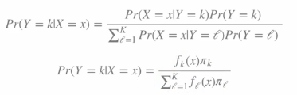

# Model Based Predictions

The goal is to build a parametric model for conditional distribution $P(Y = k | X = x)$. A typical approach is to use Baye's theorem

Typically prior probabilities ($\pi_k$) are set in advance. A common choice for $f_k$ is the normal distribution. We estimate $(\mu_k, \sigma_k^2)$ from the data.
