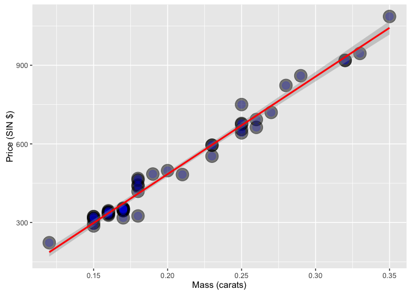
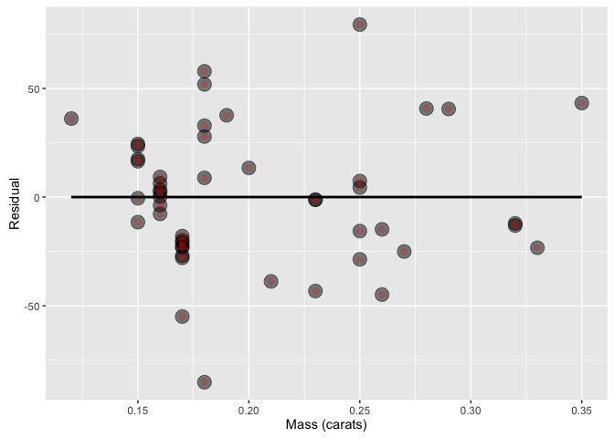
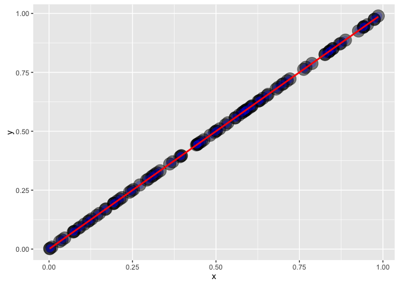
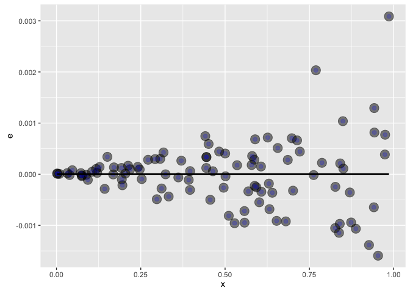
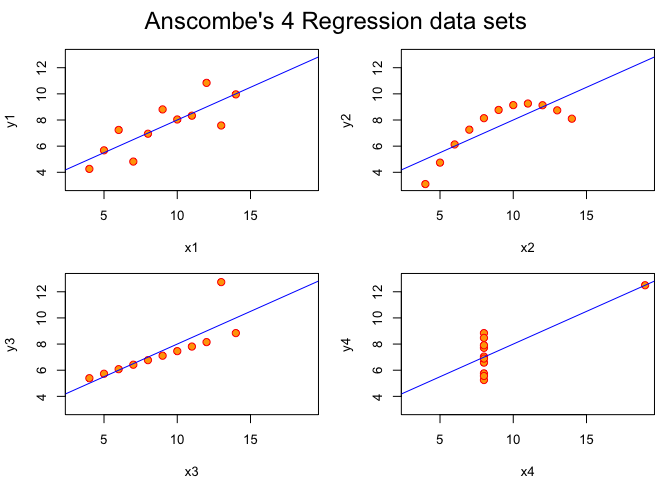

# Residuals

We will make use of the diamonds dataset, which gives the price of diamonds (singapore dollars) per unit mass (carats, defined as 0.2 g)


```r
library(UsingR); data(diamond)
```


```r
# lin model fit
fit <- lm(price ~ carat, data = diamond)
coefficients(fit)
```

```
## (Intercept)       carat 
##   -259.6259   3721.0249
```

Here's a nice plot of the data


```r
library(ggplot2)

ggplot(diamond, aes(x = carat, y = price)) +
    xlab("Mass (carats)") + ylab("Price (SIN $)") + 
    geom_point(size = 7, color = "black", alpha = 0.5) + 
    geom_point(size = 4, color = "blue", alpha = 0.2) + 
    geom_smooth(method = "lm", color = "red")
```

\

Recall residuals are just the distance between the data (price in this case) and the estimated data (the line Y_i) 


```r
e <- resid(fit) # easy way
```

It may be a good idea to plot the residuals vs the predictor, to see if there is variability in it. If the plot appears random, that means that the model chosen predicts the value well. If there is a more complex pattern such as sinusoidal variation, you may want to consider updating your model.


```r
ggplot(diamond, aes(x = carat, y = e)) +
    xlab("Mass (carats)") + ylab("Residual") + 
    geom_point(size = 5, color = "black", alpha = 0.5) + 
    geom_point(size = 2, color = "red", alpha = 0.2) +
    geom_smooth(method = "lm", se = FALSE, color = "black")
```

\

Here is an example showing how the fit may appear to be linear, however the residual plot shows way to the contrary. We sample from the uniform distribution and add samples from the normal distribution and fit a line. They appear to be harmoniously linearly related, but plot the residuals and see otherwise:


```r
x <- runif(100, 0, 1)
y <- x + rnorm(100, 0, 0.001*x)
ggplot(data.frame(x = x, y = y), aes(x = x, y = y)) +
    geom_point(size = 7 , color = "black", alpha = 0.5) + 
    geom_point(size = 4, color = "blue", alpha = 0.2) + 
    geom_smooth(method = "lm", color = "red")
```

\

Now the residuals:


```r
e <- resid(lm(y ~ x))
ggplot(data.frame(x = x, y = e), aes(x = x, y = e)) +
    geom_point(size = 5 , color = "black", alpha = 0.5) + 
    geom_point(size = 2, color = "blue", alpha = 0.2) + 
    geom_smooth(method = "lm", color = "black", se = F)
```

\


# Estimating residual variation

This is estimated by `sigma` in your `fit` variable


```r
fit$sigma
```

```
## NULL
```

# R Squared

($R^2$) This is defined as the percentage of variation explained by the regression model. It is also defined as the sample correlation squared. It can be a misleading summary of model fit, as deleting data can inflate $R^2$, type `example(anscombe)` and see an interesting example of these misleading behaviors.


```r
example(anscombe)
```

```
## 
## anscmb> require(stats); require(graphics)
## 
## anscmb> summary(anscombe)
##        x1             x2             x3             x4    
##  Min.   : 4.0   Min.   : 4.0   Min.   : 4.0   Min.   : 8  
##  1st Qu.: 6.5   1st Qu.: 6.5   1st Qu.: 6.5   1st Qu.: 8  
##  Median : 9.0   Median : 9.0   Median : 9.0   Median : 8  
##  Mean   : 9.0   Mean   : 9.0   Mean   : 9.0   Mean   : 9  
##  3rd Qu.:11.5   3rd Qu.:11.5   3rd Qu.:11.5   3rd Qu.: 8  
##  Max.   :14.0   Max.   :14.0   Max.   :14.0   Max.   :19  
##        y1               y2              y3              y4        
##  Min.   : 4.260   Min.   :3.100   Min.   : 5.39   Min.   : 5.250  
##  1st Qu.: 6.315   1st Qu.:6.695   1st Qu.: 6.25   1st Qu.: 6.170  
##  Median : 7.580   Median :8.140   Median : 7.11   Median : 7.040  
##  Mean   : 7.501   Mean   :7.501   Mean   : 7.50   Mean   : 7.501  
##  3rd Qu.: 8.570   3rd Qu.:8.950   3rd Qu.: 7.98   3rd Qu.: 8.190  
##  Max.   :10.840   Max.   :9.260   Max.   :12.74   Max.   :12.500  
## 
## anscmb> ##-- now some "magic" to do the 4 regressions in a loop:
## anscmb> ff <- y ~ x
## 
## anscmb> mods <- setNames(as.list(1:4), paste0("lm", 1:4))
## 
## anscmb> for(i in 1:4) {
## anscmb+   ff[2:3] <- lapply(paste0(c("y","x"), i), as.name)
## anscmb+   ## or   ff[[2]] <- as.name(paste0("y", i))
## anscmb+   ##      ff[[3]] <- as.name(paste0("x", i))
## anscmb+   mods[[i]] <- lmi <- lm(ff, data = anscombe)
## anscmb+   print(anova(lmi))
## anscmb+ }
## Analysis of Variance Table
## 
## Response: y1
##           Df Sum Sq Mean Sq F value  Pr(>F)   
## x1         1 27.510 27.5100   17.99 0.00217 **
## Residuals  9 13.763  1.5292                   
## ---
## Signif. codes:  0 '***' 0.001 '**' 0.01 '*' 0.05 '.' 0.1 ' ' 1
## Analysis of Variance Table
## 
## Response: y2
##           Df Sum Sq Mean Sq F value   Pr(>F)   
## x2         1 27.500 27.5000  17.966 0.002179 **
## Residuals  9 13.776  1.5307                    
## ---
## Signif. codes:  0 '***' 0.001 '**' 0.01 '*' 0.05 '.' 0.1 ' ' 1
## Analysis of Variance Table
## 
## Response: y3
##           Df Sum Sq Mean Sq F value   Pr(>F)   
## x3         1 27.470 27.4700  17.972 0.002176 **
## Residuals  9 13.756  1.5285                    
## ---
## Signif. codes:  0 '***' 0.001 '**' 0.01 '*' 0.05 '.' 0.1 ' ' 1
## Analysis of Variance Table
## 
## Response: y4
##           Df Sum Sq Mean Sq F value   Pr(>F)   
## x4         1 27.490 27.4900  18.003 0.002165 **
## Residuals  9 13.742  1.5269                    
## ---
## Signif. codes:  0 '***' 0.001 '**' 0.01 '*' 0.05 '.' 0.1 ' ' 1
## 
## anscmb> ## See how close they are (numerically!)
## anscmb> sapply(mods, coef)
##                   lm1      lm2       lm3       lm4
## (Intercept) 3.0000909 3.000909 3.0024545 3.0017273
## x1          0.5000909 0.500000 0.4997273 0.4999091
## 
## anscmb> lapply(mods, function(fm) coef(summary(fm)))
## $lm1
##              Estimate Std. Error  t value    Pr(>|t|)
## (Intercept) 3.0000909  1.1247468 2.667348 0.025734051
## x1          0.5000909  0.1179055 4.241455 0.002169629
## 
## $lm2
##             Estimate Std. Error  t value    Pr(>|t|)
## (Intercept) 3.000909  1.1253024 2.666758 0.025758941
## x2          0.500000  0.1179637 4.238590 0.002178816
## 
## $lm3
##              Estimate Std. Error  t value    Pr(>|t|)
## (Intercept) 3.0024545  1.1244812 2.670080 0.025619109
## x3          0.4997273  0.1178777 4.239372 0.002176305
## 
## $lm4
##              Estimate Std. Error  t value    Pr(>|t|)
## (Intercept) 3.0017273  1.1239211 2.670763 0.025590425
## x4          0.4999091  0.1178189 4.243028 0.002164602
## 
## 
## anscmb> ## Now, do what you should have done in the first place: PLOTS
## anscmb> op <- par(mfrow = c(2, 2), mar = 0.1+c(4,4,1,1), oma =  c(0, 0, 2, 0))
## 
## anscmb> for(i in 1:4) {
## anscmb+   ff[2:3] <- lapply(paste0(c("y","x"), i), as.name)
## anscmb+   plot(ff, data = anscombe, col = "red", pch = 21, bg = "orange", cex = 1.2,
## anscmb+        xlim = c(3, 19), ylim = c(3, 13))
## anscmb+   abline(mods[[i]], col = "blue")
## anscmb+ }
```

\

```
## 
## anscmb> mtext("Anscombe's 4 Regression data sets", outer = TRUE, cex = 1.5)
## 
## anscmb> par(op)
```
