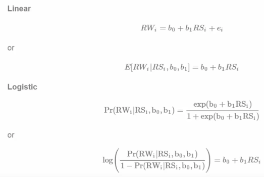
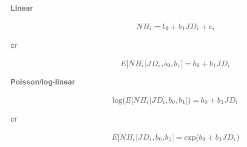

A GLM has 3 components:

* An exponential family model for the response
* A systematic component via a linear predictor
* A link function that connects the means of the response to the linear predictor

Assume that $Y_i$ ~ $N(\mu_i, \sigma^2)$. Define the linear predictor to be $\eta_i = \sum_{k} X_{ik}\beta_k$. Then we define the link function as $g$ such that $g(\mu) = \eta$ and $\mu_i = \eta_i$

# Logistic Regression

Assume that $Y_i$ ~ $Bernoulli(\mu_i)$ s.t. $E[Y_i] = \mu_i$ where $0 \leq \mu_i \leq 1$. The linear predictor is the same, it is 

#### $\eta = \sum_{k} X_{ik}\beta_k$

The link function in this case is 

#### $g(\mu) = \eta = log\left(\frac{\mu}{1-\mu} \right)$

$g$ is the log of odds, referred to as the logit.

# Linear VS Logistic

</img>

In `R` you fit a logistic regression via `glm(y ~ x, family = "binomial")`. Simple as that 

# Linear VS Poisson

</img>

In poisson regression you simply use `family="poisson"` in the `glm` option. 