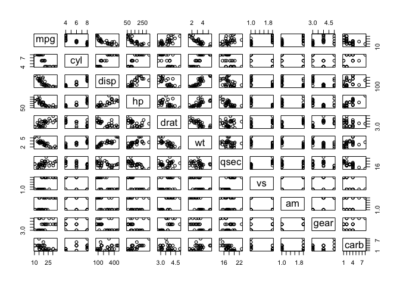
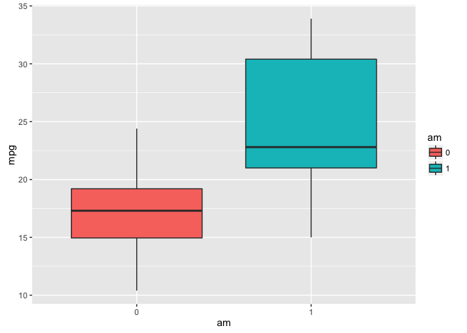
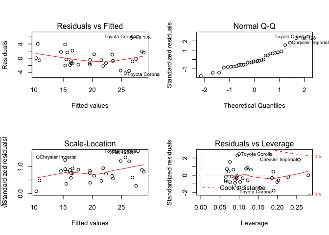

# Course Project

# The Problem Setting

You work for Motor Trend, a magazine about the automobile industry. Looking at a data set of a collection of cars, they are interested in exploring the relationship between a set of variables and miles per gallon (MPG) (outcome). They are particularly interested in the following two questions:

* Is an automatic or manual transmission better for MPG?
* Quantify the MPG difference between automatic and manual transmissions

# The Data

First we load up the data, we've seen this data in a number of examples in lectures as well as quizzes. It has 11 variables with 32 observations of different car models. First let's take a look at a pairs plot of the data to evaluate if there are any observed relationships to the eye. 


```r
data(mtcars)
head(mtcars)
```

```
##                    mpg cyl disp  hp drat    wt  qsec vs am gear carb
## Mazda RX4         21.0   6  160 110 3.90 2.620 16.46  0  1    4    4
## Mazda RX4 Wag     21.0   6  160 110 3.90 2.875 17.02  0  1    4    4
## Datsun 710        22.8   4  108  93 3.85 2.320 18.61  1  1    4    1
## Hornet 4 Drive    21.4   6  258 110 3.08 3.215 19.44  1  0    3    1
## Hornet Sportabout 18.7   8  360 175 3.15 3.440 17.02  0  0    3    2
## Valiant           18.1   6  225 105 2.76 3.460 20.22  1  0    3    1
```

```r
mtcars$vs <- as.factor(mtcars$vs); mtcars$am <- as.factor(mtcars$am) # should be categorical
pairs(mtcars)
```

\

Now let's make a plot the first question "Is an automatic or manual transmission better for MPG?":


```r
library(ggplot2)
g <- ggplot(mtcars, aes(am, mpg))
g <- g + geom_boxplot(aes(fill=am))
g
```

\

Automatic is labeled as 1 and non automatic is labeled as 0. However there are a total of 10 predictors in this dataset, therefore there may be some interaction between them. Let's do an analysis of variance on all the predictors to see which play a bigger role in the determination of mpg:


```r
summary(aov(mpg ~ ., data = mtcars))
```

```
##             Df Sum Sq Mean Sq F value   Pr(>F)    
## cyl          1  817.7   817.7 116.425 5.03e-10 ***
## disp         1   37.6    37.6   5.353  0.03091 *  
## hp           1    9.4     9.4   1.334  0.26103    
## drat         1   16.5    16.5   2.345  0.14064    
## wt           1   77.5    77.5  11.031  0.00324 ** 
## qsec         1    3.9     3.9   0.562  0.46166    
## vs           1    0.1     0.1   0.018  0.89317    
## am           1   14.5    14.5   2.061  0.16586    
## gear         1    1.0     1.0   0.138  0.71365    
## carb         1    0.4     0.4   0.058  0.81218    
## Residuals   21  147.5     7.0                     
## ---
## Signif. codes:  0 '***' 0.001 '**' 0.01 '*' 0.05 '.' 0.1 ' ' 1
```

We can remove those models whose p-value is greater than 0.05. We do this in an automated way by doing:


```r
s <- summary(aov(mpg ~ ., data = mtcars))
# get the actual array info out of summary
s <- s[[1]]

# remove the row of residuals for now
idx <- s$`Pr(>F)`<0.05
rownames(s[idx, ])
```

```
## [1] "cyl        " "disp       " "wt         " "NA"
```

So now let's update the model accordingly


```r
fit2 <- lm(mpg ~ cyl + disp + wt + drat + am, data = mtcars)
summary(fit2)
```

```
## 
## Call:
## lm(formula = mpg ~ cyl + disp + wt + drat + am, data = mtcars)
## 
## Residuals:
##     Min      1Q  Median      3Q     Max 
## -4.3176 -1.3829 -0.4728  1.3229  6.0596 
## 
## Coefficients:
##              Estimate Std. Error t value Pr(>|t|)    
## (Intercept) 41.296380   7.538394   5.478 9.56e-06 ***
## cyl         -1.793995   0.650540  -2.758  0.01051 *  
## disp         0.007375   0.012319   0.599  0.55462    
## wt          -3.587041   1.210500  -2.963  0.00643 ** 
## drat        -0.093628   1.548780  -0.060  0.95226    
## am1          0.172981   1.530043   0.113  0.91085    
## ---
## Signif. codes:  0 '***' 0.001 '**' 0.01 '*' 0.05 '.' 0.1 ' ' 1
## 
## Residual standard error: 2.692 on 26 degrees of freedom
## Multiple R-squared:  0.8327,	Adjusted R-squared:  0.8005 
## F-statistic: 25.88 on 5 and 26 DF,  p-value: 2.528e-09
```

Again the same thing, refine the model


```r
fit3 <- lm(mpg ~ cyl + disp + wt + am, data = mtcars)
summary(fit3)
```

```
## 
## Call:
## lm(formula = mpg ~ cyl + disp + wt + am, data = mtcars)
## 
## Residuals:
##    Min     1Q Median     3Q    Max 
## -4.318 -1.362 -0.479  1.354  6.059 
## 
## Coefficients:
##              Estimate Std. Error t value Pr(>|t|)    
## (Intercept) 40.898313   3.601540  11.356 8.68e-12 ***
## cyl         -1.784173   0.618192  -2.886  0.00758 ** 
## disp         0.007404   0.012081   0.613  0.54509    
## wt          -3.583425   1.186504  -3.020  0.00547 ** 
## am1          0.129066   1.321512   0.098  0.92292    
## ---
## Signif. codes:  0 '***' 0.001 '**' 0.01 '*' 0.05 '.' 0.1 ' ' 1
## 
## Residual standard error: 2.642 on 27 degrees of freedom
## Multiple R-squared:  0.8327,	Adjusted R-squared:  0.8079 
## F-statistic: 33.59 on 4 and 27 DF,  p-value: 4.038e-10
```

Now the last variable we remove is `disp`. Our final model is then


```r
final_fit <- lm(mpg ~ cyl + wt + am, data = mtcars)
summary(final_fit)
```

```
## 
## Call:
## lm(formula = mpg ~ cyl + wt + am, data = mtcars)
## 
## Residuals:
##     Min      1Q  Median      3Q     Max 
## -4.1735 -1.5340 -0.5386  1.5864  6.0812 
## 
## Coefficients:
##             Estimate Std. Error t value Pr(>|t|)    
## (Intercept)  39.4179     2.6415  14.923 7.42e-15 ***
## cyl          -1.5102     0.4223  -3.576  0.00129 ** 
## wt           -3.1251     0.9109  -3.431  0.00189 ** 
## am1           0.1765     1.3045   0.135  0.89334    
## ---
## Signif. codes:  0 '***' 0.001 '**' 0.01 '*' 0.05 '.' 0.1 ' ' 1
## 
## Residual standard error: 2.612 on 28 degrees of freedom
## Multiple R-squared:  0.8303,	Adjusted R-squared:  0.8122 
## F-statistic: 45.68 on 3 and 28 DF,  p-value: 6.51e-11
```

This says that we cannot reject the null hypothesis that the coefficient of am is 0. Let's do some diagnostic plots before making any conclusions, showing the Q-Q plot and residual plot among others:


```r
par(mfrow = c(2, 2))
plot(final_fit)
```

\

There is no real pattern in the residual plot which is very relieving. The Q-Q plot tells us that our assumption of normality is not violated. There is a rather large difference between MPG for automatic and manual transmissions. All in all, manual transmissions will get you more miles on the gallon.
