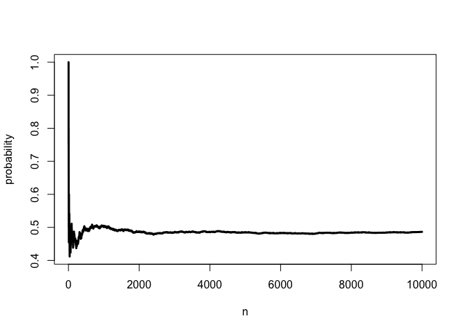

# Assymptotics

This is the term for the behavior of statistics as the sample size limits to infinity. The law of large numbers states that the average limits to what it's estimating, the population mean. So if you were to flip a coin a very large number of times, you would get heads half the time.


```r
n <- 10000
probability <- cumsum(rnorm(n))/(1:n)
plot(probability, type = "l", lwd = 3, xlab='n')
```

\

Here's the law of large number in action for coin flips:


```r
probability <- cumsum(sample(0:1, n, replace = TRUE))/(1:n)
plot(probability, type = "l", lwd = 3, xlab = 'n')
```

\

# Central Limit Theorem

The CLT states (slightly dumbed down) that the distribution of averages of i.i.d. variables (properly normalized) becomes that of a standard normal as the sample size increases

</img>
