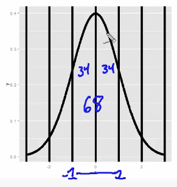

Normals are the fabled bell curves. This is the most important distribution out there. Some important numbers to keep in mind:

</img>

This image says that 34% of the distribution should be at 1 standard deviation below the mean, and another 34% should be at one standard deviation above the mean, for a total of 68%. 2 standard deviations should encompass 47.5% each, so being 2 standard deviations above and below the mean encompasses 95% of the normal distribution. Nice. 

What is the probability that a $N(\mu, \sigma^2)$ random variable is larger than x? In `R` this is simply `pnorm(x, mean = mu, sd = sigma, lower.tail = FALSE)`

Example: Assume the number of daily add clicks for a company is approximately normal with mean 1020 and sd 50. What's the probability of getting more than 1200 clicks in a day?

```{r}
pnorm(1160, mean = 1020, sd = 50, lower.tail = F)
```

Not very likely.

Example: Assume the number of daily add clicks for a company is approximately normal with mean 1020 and sd 50. What number of daily ad clicks would represent the one where 75% of days have fewer clicks? Assume days are i.i.d.

```{r}
qnorm(0.75, mean = 1020, sd = 50)
```

About 1053 ad clicks represents days 