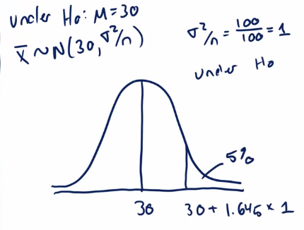

# Hypothesis Testing

Hypothesis testing is concerned with making decisions using data. A null hypothesis is specified that represents the status quo, usually labeled $H_0$ (also called the null hypothesis). The null is assumed true and statistical evidence is required to reject it in favor of a research or alternative hypothesis. 

The alternative hypotheses (usually called $H_a$) are typically of the form $<$,$>$, or $\neq$. 

# Choosing A Rejection Region

**Example**: A respiratory disturbance index of more than events/hour, say, is considered evidence of severe sleep disordered breathing (SDB). Suppose that in a sample of 100 overweight subjects with other risk factors for sleep disordered breathing at a sleep clinic, the mean RDI was 32 events/hour with a standard deviation of 10 events/hour. 

A reasonable strategy would reject the null if $\bar{X}$ was larger than some constant, C. Typically C is chosen such that the probability of Type I error, $\alpha$, is $0.05$. Therefore $\alpha$ is the Type I error rate = probability of rejecting the null when the null is correct.

The standard error of the mean is $\sigma/\sqrt{n} = 10/\sqrt{100}$

Under $H_0:\: \bar{X} ~ N(30, 1)$, we want to choose C such that $P(\bar{X}>C; H_0) is 5%. The 95th percentile of a normal distribution is 1.645 standard deviations from the mean. If we set $C = 30 + 1\cdot 1.645 = 31.645$, we will have achieved a cut point such that the probability of a randomly drawn mean that is larger than this is 5%. Here's an illustration showing this (drawn by Brian Caffo from lecture):



So the rule is to reject $H_0$ when $\bar{X}\geq 31.645$ to achieve this in this case.

In general we don't convert C back to the original scale. We would just reject based on the Z-score; which is how many standard errors the sample mean is above the hypothesized mean:

#### $\frac{32 - 30}{10/\sqrt{100}} = 2 > 1.645$

Or, more generally, whenever 

#### $\sqrt{n} \left(\bar{X} - \mu_0\right)\cdot s > Z_{1-\alpha}$

# T Tests

Consider the same example as above. Suppose that this time the sample size is $n = 16$ this time. The statistics

#### $\frac{\bar{X} - 30}{s/\sqrt{16}}$ 

now follow a t distribution with 15 df under $H_0$. The 95th percentile of the t distribution with 15 df is 1.7531 (see below)


```r
qt(.95, 15)
```

```
## [1] 1.75305
```

So that our test statistic is now $\sqrt{16}(32-20)/10 = 0.8 < 1.7531$, therefore we fail to reject $H_0$.

## Two sided tests

Suppose we would reject the null that if the mean was too large OR too small, i.e. we want to test the alternative $H_a:\: \mu \neq 30$. We will reject if the test statistic (0.8 in this case) is either *too large* or *too small*. What changes is we want to be able to get that 5% in both tails. Essentially we want to split equaly into 2.5% in the upper and 2.5% in the lower tails. Thus we reject if our test statistic is larger than `qt(.975, 15)` or smaller than `qt(.025, 15)`


```r
qt(.975, 15)
```

```
## [1] 2.13145
```

```r
qt(.025, 15)
```

```
## [1] -2.13145
```

Since `qt(.975, 15) == -qt(.025, 15)`, this is the same as saying we reject if the absolute value of our test statistic is larger than `qt(.975, 15)`. Gotta love symmetry. In this case we also fail to reject the null though.

***If you fail to reject the one sided test, you know that you will fail to reject the two sided***

Usually we don't calculate the regions by hand, we just make use of `R` or another language. Here's an example of father and son heights data


```r
library(UsingR)
data(father.son)
t.test(father.son$sheight - father.son$fheight)
```

```
## 
## 	One Sample t-test
## 
## data:  father.son$sheight - father.son$fheight
## t = 11.789, df = 1077, p-value < 2.2e-16
## alternative hypothesis: true mean is not equal to 0
## 95 percent confidence interval:
##  0.8310296 1.1629160
## sample estimates:
## mean of x 
## 0.9969728
```

The confidence interval can be constructed as the set of all values for which you fail the hypothesis test.

# Two Group Intervals

Now we know how to do two group t tests since we already covered independent group t intervals. The rejection rules are the same, test is now $H_0: \: \mu_1 = \mu_2$

**Example**: Recall the chick weight data. Remember we reformated this data


```r
library(datasets); data(ChickWeight); library(reshape2)
##define weight gain or loss
wideCW <- dcast(ChickWeight, Diet + Chick ~ Time, value.var = "weight")
names(wideCW)[-(1 : 2)] <- paste("time", names(wideCW)[-(1 : 2)], sep = "")
library(dplyr)
wideCW <- mutate(wideCW, gain = time21 - time0)

# compare diets 1 and 4. we can only compare two predictors at a time with '~'
wideCW14 <- subset(wideCW, Diet %in% c(1,4))

# compare using two sample t test
t.test(gain ~ Diet, paired = F, var.equal = F, data = wideCW14)
```

```
## 
## 	Welch Two Sample t-test
## 
## data:  gain by Diet
## t = -2.9615, df = 20.937, p-value = 0.007464
## alternative hypothesis: true difference in means is not equal to 0
## 95 percent confidence interval:
##  -104.65901  -18.29932
## sample estimates:
## mean in group 1 mean in group 4 
##        136.1875        197.6667
```

Our t statistic calculates how many estimated standard errors our difference in means is from our hypothesized mean.
